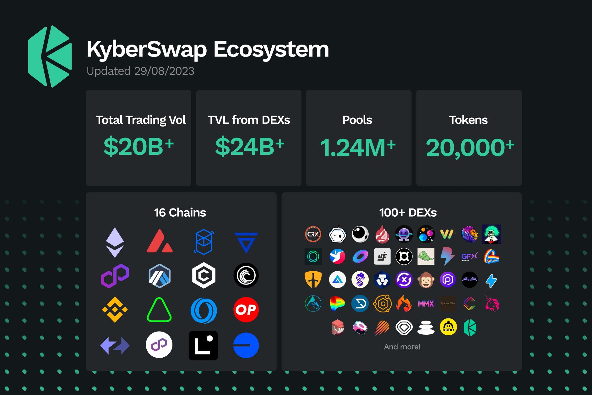

# Introduction to KyberSwap

Kyber Network is building a world to make DeFi accessible, safe and rewarding for users. Our flagship product, [KyberSwap](http://www.kyberswap.com), is a next-gen [DEX aggregator](getting-started/foundational-topics/decentralized-finance/dex-aggregator.md) providing superior rates for traders and maximizing returns for liquidity providers in DeFi.&#x20;


For more information on Kyber Network, the organization, please visit the official [Kyber Network page](https://kyber.network/).&#x20;


For liquidity providers, KyberSwap has a suite of capital efficient protocols designed to optimize rewards. KyberSwap [Classic’s](liquidity-solutions/kyberswap-classic/) protocol is DeFi’s first market maker protocol that [dynamically adjusts liquidity provider (LP) fees based on market conditions](liquidity-solutions/kyberswap-classic/concepts/flexible-fee-adjustment.md), while KyberSwap [Elastic](liquidity-solutions/kyberswap-elastic/) is a tick-based AMM with [concentrated liquidity](liquidity-solutions/kyberswap-elastic/concepts/concentrated-liquidity.md), customizable fee tiers, [reinvestment curve](liquidity-solutions/kyberswap-elastic/concepts/reinvestment-curve.md) and other advanced features specially designed to give LPs the flexibility and tools to take your earning strategy to the next level without compromising on security.

KyberSwap powers 100+ integrated projects and has facilitated over US$17 billion worth of transactions for thousands of users since its inception.

Currently deployed on 15 chains, including Ethereum, BSC, Arbitrum, Polygon PoS, Optimism, Avalanche, Cronos, ZkSync Era, Fantom, Polygon zkEVM, Aurora, Linea, BitTorrent, Velas, and Oasis. KyberSwap aggregates liquidity from over 80 DEXs and multiple Aggregators to enable users to swap at superior rates.

<figure><figcaption>
The KyberSwap Ecosystem
</figcaption></figure>

## Our Solutions

KyberSwap's solution suite was conceived with the goal of creating an open and decentralized liquidity backbone for the DeFi ecosystem. Through a combination of solutions, KyberSwap is able to optimize capital efficiency across DEXes thereby simultaneously ensuring superior rates for traders and maximum yield for LPs. Built on the principles of open access to decentralized financial infrastructure, the KyberSwap solution suite enables value in the DeFi space to be compounded sustainably through aligning liquidity incentives.

### KyberSwap Solutions

* [**KyberSwap Interface**](kyberswap-solutions/kyberswap-interface/) is a one stop [web interface](https://kyberswap.com/) providing convenient and open access to some of the best liquidity solutions and experiences in DeFi. This includes taking advantage of KyberSwap's Aggregator to swap at the best rates, earning boosted yields through providing liquidity to KyberSwap's Classic and Elastic protocols, discovering trending tokens before the rest of the market, and much more...
* [**KyberSwap Aggregator**](kyberswap-solutions/kyberswap-aggregator/) enables traders to swap at superior rates by seamlessly connecting users and applications to siloed liquidity across various decentralized exchanges and multiple chains. Through splitting and optimizing trade routes, KyberSwap Aggregator is able to objectively discover capital efficient liquidity sources thereby ensuring favourable swap rates while encouraging greater market stability. Unlike other protocols, we do not charge any fees to our traders for our aggregator - 0% fee forever.
* [**KyberSwap Widget**](kyberswap-solutions/kyberswap-widget/) enables developer teams to easily integrate swap functionality into their application with just a few lines of code. Seamlessly blend the best swap rates into your app with practically unlimited widget customization options.
* [**Limit Order**](kyberswap-solutions/limit-order/) provides traders the ability to predefine their preferred swap rates which are automatically settled on-chain by KyberSwap smart contracts when market conditions favor the trader. Define your preferred trade parameters and have complete ownership of your assets while KyberSwap sources a matching counter-party.
* [**KyberSwap Bridge**](broken-reference) solution allows users to conveniently bridge tokens between multiple supported chains. KyberSwap has integrated with the [Multichain](broken-reference) cross-chain router protocol hence enabling users to bridge their assets straight from the [KyberSwap Interface](https://kyberswap.com/bridge).
* [**KyberAI**](kyberswap-solutions/kyberai/) democratizes trading data by surfacing valuable trading insights in easily digestible formats that can be conveniently accessed directly on the KyberSwap Interface. KyberAI also incorporates the power of machine learning to deliver [KyberScore](kyberswap-solutions/kyberai/kyberscore.md), a single number indicating the extent of a token's bullishness or bearishness over the next 24 hours.
* [**KyberSwap Cross-Chain Swaps**](kyberswap-solutions/kyberswap-interface/user-guides/swap-between-different-tokens-across-chains.md) provides users with a simple interface to directly swap tokens on one chain for a separate token on another chain. KyberSwap has integrated with the [Squid](https://docs.squidrouter.com/) swap and liquidity routing protocol thereby enabling users to perform cross-chain swaps straight from the [KyberSwap Interface](https://kyberswap.com/cross-chain).

### Liquidity Solutions

* [**KyberSwap Classic**](liquidity-solutions/kyberswap-classic/) maximises yield for LPs through [programmable pricing curves](liquidity-solutions/kyberswap-classic/concepts/dynamic-pricing-curves.md) as well as [dynamic auto-adjusting fees](liquidity-solutions/kyberswap-classic/concepts/flexible-fee-adjustment.md) which responds to market conditions. Deposit your tokens into capitally efficient pools and let the protocol optimize your returns based on market volatility.
* [**KyberSwap Elastic**](liquidity-solutions/kyberswap-elastic/) allows LPs to provide liquidity into [customizable price ranges](liquidity-solutions/kyberswap-elastic/concepts/concentrated-liquidity.md) while still maximizing returns through the [auto-compounding of yields](liquidity-solutions/kyberswap-elastic/concepts/reinvestment-curve.md). Choose your preferred concentrated liquidity positions and the protocol automatically reinvests your returns into the pool at an infinite range.
