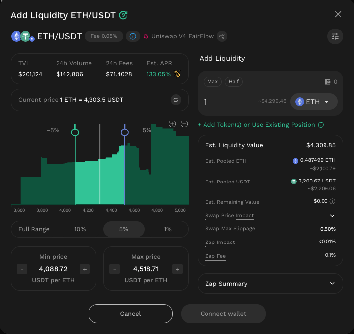

# Position APR Estimation

The Position APR Estimation feature - currently implemented in FairFlow farming pools - displays an Estimated Position APR when users select their desired price range during the liquidity provision process. This estimation reflects the potential annual returns from three key components: Liquidity Pool (LP) Fees, Equilibrium Gain (EG) rewards, and Liquidity Mining (LM) incentives.\
\
Estimated Position APR is the estimated annual return a liquidity provider may earn from a position based on user’s inputs with active liquidity share and chosen price range. This value serves as a reference metric to assist users in evaluating and comparing different price range strategies under pool’s market conditions.

<figure><figcaption></figcaption></figure>

### How the Estimated Position APR is calculated

The Estimated Position APR displayed while adding liquidity in any of Fair Flow farming pools is derived from three key components representing a user’s potential total return: LP Fees, EG rewards, and LM rewards. Each component is calculated and displayed separately, as explained below, and then combined to form the **Total Estimated Position APR** shown to users.

#### Estimated Liquidity Provider (LP) Fee APR

**Estimated Position’s Fee Earned per Second**:

<figure><figcaption></figcaption></figure>

* _**F**__**pool**_ is the estimated total trading fees generated by the pool per second.
  *   For pools older than 24h:

      <figure><figcaption></figcaption></figure>

      * _**volume24h:**_ volume in the last 24h.
  *   For new pools (< 24h old):

      <figure><figcaption></figcaption></figure>
*  represents the position’s share of total active liquidity.
  * _**L**__**position**_ is the position’s liquidity amount, representing how much active liquidity the user contributes to the pool.
  * _**L**_ is the total active liquidity in the pool, which is the combined liquidity from all positions currently within the active price range.

**Estimated LP Fee APR:**

<figure><figcaption></figcaption></figure>

* _**TVL**__**position**_ is the total value locked in the position (sum of the USD value of token₀ and token₁ in the position).

This estimation assumes that the pool serves the same volume over the last 24 hours and the price stays in the current active range.

#### Estimated Equilibrium Gain (EG) Reward APR

**Estimated EG reward APR** follows the same calculation method as the **Estimated LP Fee APR**, but instead of using _**F**__**pool**_ (total trading fees generated by the pool per second), it uses the **total** **EG rewards generated by the pool per second,** which were distributed among all active liquidity positions in the pool.

Learn more about EG: [https://docs.kyberswap.com/kyberswap-solutions/kyberswap-fairflow/solution-fairflow](https://docs.kyberswap.com/kyberswap-solutions/kyberswap-fairflow/solution-fairflow).

#### Estimated Liquidity Mining (LM) Reward APR

**Standard Deviation&#x20;**_**s**_

<figure><figcaption></figcaption></figure>

* Configuration (Distribution Range): _**N**_ (number of ticks), derived from historical data. This range is related to the average size of a range in historical data that covers 95% of the price chart/ reward distribution.

**Estimated Reward Share for Range**:

<figure><figcaption></figcaption></figure>

* Current tick (_**t**__**c**_): Current price in the pool.
* Tick lower (_**t**__**l**_): Lower range of the position.
* Tick upper (_**t**__**u**_): Upper range of the position.
* The reward is assumed to follow a normal distribution centered at the current tick. The width of the distribution is configured using historical price data. Hence, the normal distribution Cumulative Distribution Function (CDF) is used here to estimate the share of reward for each tick.

**Estimated Position LM Reward per Second**:

<figure><figcaption></figcaption></figure>

* Total Reward per Second (_**R**_): Reward allocated per second for the pool
*   represents the position’s share of total active liquidity.
  * _**L**__**position**_ is the position’s liquidity amount, representing how much active liquidity the user contributes to the pool.
  * _**L**_ is the total active liquidity in the pool, which is the combined liquidity from all positions currently within the active price range.

**Estimated LM Reward APR:**

<figure><figcaption></figcaption></figure>

* _**TVL**__**position**_ is the total value locked in the position (sum of the USD value of token0 and token1 in the position).

<mark style="color:$primary;background-color:$info;">**Disclaimer:**</mark> <mark style="color:$primary;background-color:$info;"></mark><mark style="color:$primary;background-color:$info;">The Estimated Position APR is provided for reference purposes only. It does not guarantee future returns and may differ from actual results, which can vary based on market conditions, trading volume, price fluctuations, and user activity within the pool.</mark>
