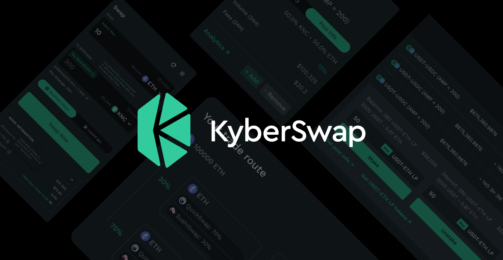

# KyberSwap Interface

## Overview

<figure><figcaption>
KyberSwap Interface
</figcaption></figure>

KyberSwap Interface is a one stop [web application](https://kyberswap.com/swap/ethereum) that grants users access to the best trading solution in the DeFi space. In the pursuit of making DeFi accessible to all, KyberSwap Interface was designed to be interoperable with the most popular [Web3 wallets](../../getting-started/foundational-topics/decentralized-technologies/wallets.md) allowing users to access all of KyberSwap functionalities while still always maintaining total control of their funds.

## Next Steps

As a window into the world of DeFi liquidity, KyberSwap Interface enables you to:

* Trade at superior market rates via the KyberSwap Aggregator
* [Trade at your preferred rates by setting Limit Orders](user-guides/trade-at-your-preferred-rates.md)
* [Swap between different tokens across chains](user-guides/swap-between-different-tokens-across-chains.md)
* Purchase crypto with a credit/debit card, mobile wallet, or bank account
* Bridge your asset across 13 chains and counting
* [Participate in KyberDAO governance](../../governance/kyberdao/user-guides/participating-in-kyberdao.md)
* [Participate in KyberSwap's multiple trading campaigns](https://kyberswap.com/campaigns/)

This list is constantly growing as we continue to rollout new features for our users. Do keep a lookout for our latest announcements which are served to you via the notification centre.
