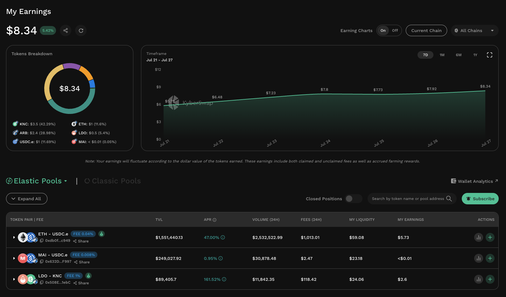

# My Earnings

## Overview

<figure><figcaption>
My Earning dashboard
</figcaption></figure>

With a single click, KyberSwap LPs can now view all their earnings across multiple liquidity protocols, chains, and pools in a single page. KyberSwap's My Earnings feature conveniently aggregates all of a LP's historical and current earnings broken down by chains, individual tokens, and even different timeframes. LPs can easily toggle between different chains and timeframes within the My Earnings page therefore providing them with a comprehensive overview of their multi-chain earnings across all KyberSwap liquidity protocols.


#### Phasing out of My Pools

My Earnings will initially be rolled out for KyberSwap Elastic (including Legacy) with support for KyberSwap Classic coming very soon. My Earnings will eventually replace the current [My Pools](https://kyberswap.com/myPools/) page providing LPs with a comprehensive view of all their earnings across all KyberSwap liquidity protocols.

