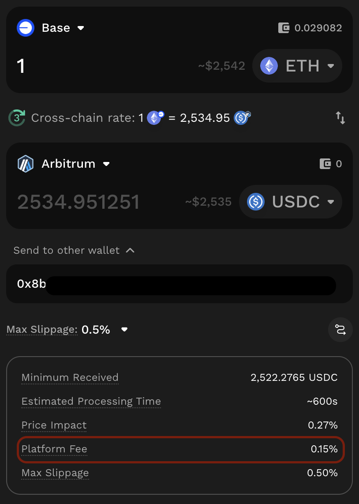
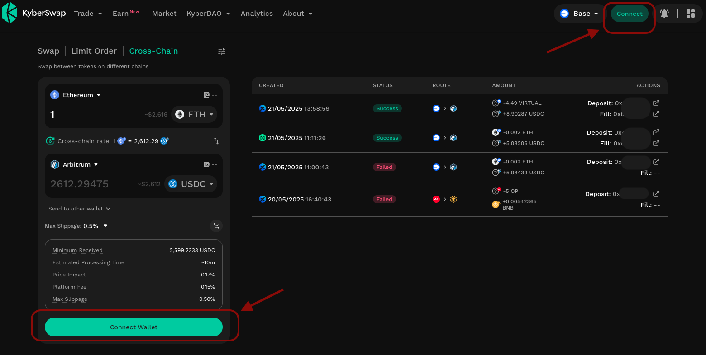
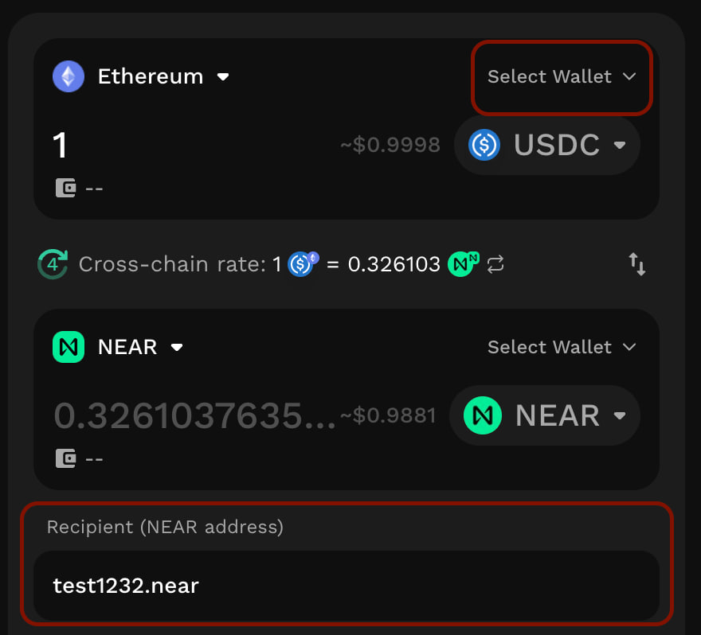
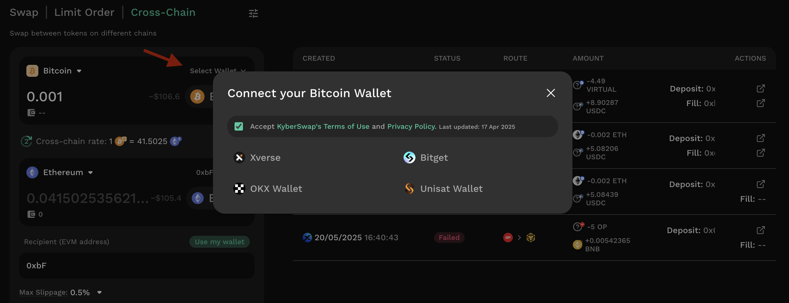
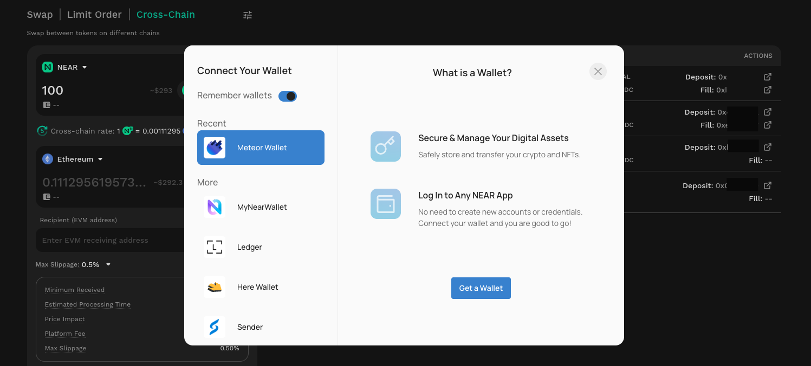
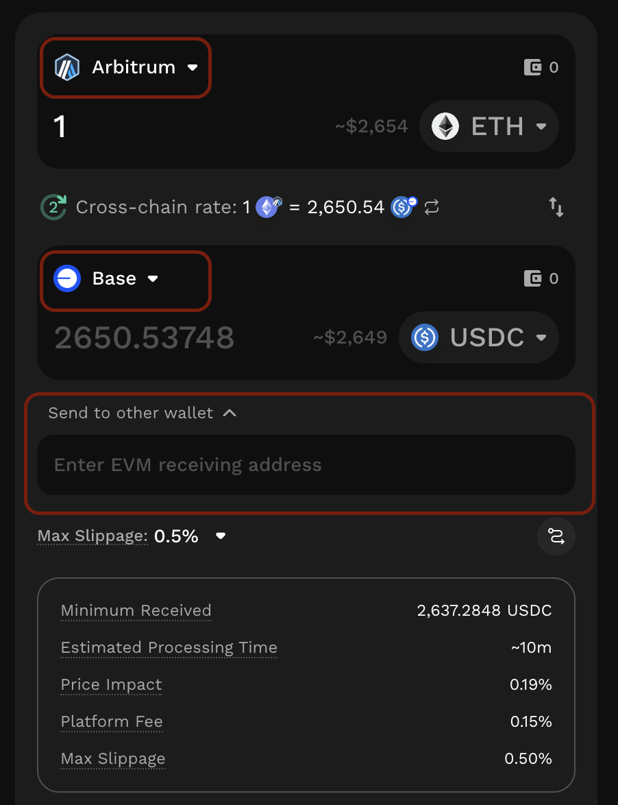
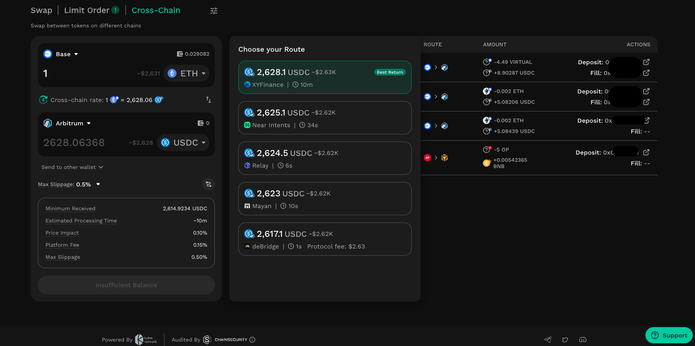

# Cross-chain Swap

## Introduction

With the introduction of Cross-Chain Swap, KyberSwap expands beyond [Swap](https://docs.kyberswap.com/kyberswap-solutions/kyberswap-aggregator) and [Limit Order](https://docs.kyberswap.com/kyberswap-solutions/limit-order) to become a comprehensive, one-stop platform for traders. Users can now access essential trading tools within a single, unified interface - without the need to switch between different protocols or platforms.

The Cross-chain Swap function on [KyberSwap.com](http://kyberswap.com/) enables users to seamlessly swap assets across different blockchain networks - all within a single, unified interface. Instead of manually interacting with multiple bridges or swapping assets across multiple DEXs, users can swap from any token on one chain to a different token on another chain, directly through KyberSwap, with no external steps required.

<figure><figcaption></figcaption></figure>

KyberSwap Cross-chain Swap feature aggregates liquidity from multiple third-party cross-chain swaps and cross-chain swap protocols. Key features include:

* KyberSwap automatically sources and compares real-time quotes on the user’s behalf across providers in real time, ensuring that users receive the **optimal price,** without needing to manually compare options themselves.
* Beyond just EVM chains, KyberSwap extends its reach to support non-EVM chains as well, significantly broadening accessibility.
* For complete transparency, users can easily view all available options from other protocols, including rates, fees, and estimated arrival times, empowering them to make informed decisions.
* Furthermore, the entire cross-chain journey is simplified with a single interface to track the status of each transaction in real-time, providing a smooth and transparent experience end-to-end.

Supported Network and Cross-chain Protocols

Supported chains include:

* [Major EVM chains currently supported on KyberSwap](https://docs.kyberswap.com/getting-started/supported-exchanges-and-networks)
* Bitcoin
* Near

Supported third-party cross-chain swaps and cross-chain swap protocols:

* Near Intent
* Across
* Relay Protocol
* XY Finance
* Debridge
* LI.FI
* Mayan Finance

_Support for chains and protocols could be changed over time._

Platform Fee

To support the continued development and maintenance of the Cross-Chain Swap, KyberSwap applies a platform fee for using this feature. When performing a cross-chain swap, the applicable platform fee is shown as “Platform Fee” in the swap details section after the route is generated and before you confirm the transaction.

<figure><figcaption></figcaption></figure>

Below is the detailed fee structure:

<table data-header-hidden><thead><tr><th width="139.953125"></th><th></th><th></th><th></th><th width="245.0859375"></th></tr></thead><tbody><tr><td><strong>Route</strong></td><td><strong>Stable pair</strong></td><td><strong>Common pair</strong></td><td><strong>Exotic pair</strong></td><td><strong>High-volatility pair</strong></td></tr><tr><td><strong>EVM ↔ EVM</strong></td><td>0.05 %</td><td>0.10 %</td><td>0.15 %</td><td>0.25 %</td></tr><tr><td><strong>Near ↔ EVM</strong></td><td>0.2%</td><td>0.2%</td><td>0.2%</td><td>0.25 %</td></tr><tr><td><strong>BTC ↔ EVM</strong></td><td>0.25 %</td><td>0.25 %</td><td>0.25 %</td><td>0.2%</td></tr><tr><td><strong>Bitcoin ↔ Near</strong></td><td>0.25 %</td><td>0.25 %</td><td>0.25 %</td><td>0.25 %</td></tr></tbody></table>

> Note: The “Platform Fee” is separate from the “Protocol Fee”. Some third-party providers may charge a protocol-specific fee for using their route. If applicable, this “Protocol Fee” will be displayed in the Swap Details when this route is selected, or within the “Choose Your Route” section during route comparison.

## User Guide

Let’s navigate to the Cross-chain tab on KyberSwap interface or visit the link: [https://kyberswap.com/cross-chain](https://kyberswap.com/cross-chain) to experience seamless asset swaps across multiple blockchain networks, no switching apps.

Connect wallet

**1.1. EVM to EVM**

<figure><figcaption></figcaption></figure>

* Source chain:
  * Simply connect your [Web3 wallet](https://docs.kyberswap.com/kyberswap-solutions/kyberswap-interface/user-guides/connect-your-wallet) using the “Connect” button in the top-right corner, or through “Connect Wallet” in the Cross-chain Swap panel.
  * Ensure that your wallet is connected to the appropriate source network. If not, the interface will prompt you to switch to the correct network before allowing you to proceed with the swap configuration.
* Destination chain:
  * No additional wallet connection is required if the same EVM-compatible wallet supports the destination networ

**1.2. EVM to Bitcoin/Near**

<figure><figcaption></figcaption></figure>

* Source chain:
  * Simply connect your [Web3 wallet](https://docs.kyberswap.com/kyberswap-solutions/kyberswap-interface/user-guides/connect-your-wallet) using the “Connect Wallet” button in the top-right corner, or through the “Select Wallet” option in the Cross-Chain Swap panel.
  * Ensure that your wallet is connected to the appropriate source network. If not, the interface will prompt you to switch to the correct network before allowing you to proceed with the swap configuration.
* Destination chain:
  * You are required to manually enter your Bitcoin/NEAR receiving address to receive the output tokens.
  * If you prefer to connect your Bitcoin/Near wallet, you can click “Select Wallet” to connect an available compatible wallet for Bitcoin or Near, depending on your chosen destination chain. In this case, the default receiving address will be your connected wallet address.

**1.3. Bitcoin to other chains**

<figure><figcaption></figcaption></figure>

* Source chain:
  * Click “Select Wallet” in the Cross-Chain Swap panel, and connect a compatible wallet available for Bitcoin.
* Destination chain:
  * You are required to manually enter your receiving address to receive the output tokens.
  * If you prefer to connect your wallet, you can click “Select Wallet” to connect an available compatible wallet for the destination chain. In this case, the default receiving address will be your connected wallet address.

**1.4. Near to other chains**

<figure><figcaption></figcaption></figure>

* Source chain:
  * Click “Select Wallet” in the Cross-Chain Swap panel, and connect a compatible wallet available for Near.
* Destination chain:
  * You are required to manually enter your receiving address to receive the output tokens.
  * If you prefer to connect your wallet, you can click “Select Wallet” to connect an available compatible wallet for the destination chain. In this case, the default receiving address will be your connected wallet address.

Configure your swap details

<figure><figcaption></figcaption></figure>

* Source Network: Choose the blockchain where your current token is held.
* Destination Network: Select the target blockchain where you want to receive the output token.
* Token Pair: Specify the token you want to swap from, and the token you wish to receive on the destination chain.
* Amount: Enter the amount of the source token you intend to swap.
* Enter the receiving address for the destination chain:
  * EVM ↔ EVM:
    * If you wish to send the output tokens to another wallet, you may enable the “Send to other wallet” option and enter the desired receiving address. **If this option is not enabled, the default receiving address will be your connected wallet address.**
  * Other network cases:
    * If you do not connect a compatible wallet for the destination chain, you are required to manually enter the receiving address to receive the output tokens.
    * If you have connected a receiving wallet to the KyberSwap interface for the destination chain, the default receiving address will be your connected wallet address.

KyberSwap will source from all available routing options from supported protocols and select the most optimal option.

<strong>View Quotes and Explore other Routing Options</strong>

<figure><figcaption></figcaption></figure>

After entering the amount, KyberSwap automatically fetches real-time quotes from multiple third-party cross-chain protocols and **selects the option that provides best rate among the quotes by default.**

For full visibility, you can click “More Options” to open the “Choose Your Route” section, where you can compare available providers, view estimated return amounts, fees, and estimated arrival times, you can choose another quote which you prefer. This transparency empowers users to make informed decisions about which route best meets their needs.

Note: Some providers may have their protocol fee for using their router; if applicable, this fee will be displayed on Swap details as “Protocol Fee” (when the route is selected) or via “Choose Your Route” section.

Review Details and Confirm Swap

<figure><figcaption></figcaption></figure>

After configuring swap details, you might need to Approve the input token first if you haven’t previously authorized the protocol to swap this token on your behalf. Once approved, click “Review the Cross-chain Swap”.

A confirmation box will be opened, where you should carefully review all transaction details: token amount, destination address, minimum received, estimated processing time, platform fee, etc.

Once everything is verified, click “Confirm Swap” and approve the transaction in your wallet.

Review transaction history

<figure><figcaption></figcaption></figure>

After initiating a cross-chain swap, users can track the entire transaction lifecycle directly within the KyberSwap interface, eliminating the need to manually monitor multiple platforms or dashboards. The \*\*\*\*transaction history panel presents a detailed overview of each swap, including the time and date when the swap is initiated, sender wallet, status, route, amount of input and output tokens, and on-chain transactions.

The status of each transaction is updated in real time to reflect its current state:

*   **Processing** – The transaction is in progress, including the swap on the source chain, bridging, and settlement on the destination chain.

    Note: Some chains or protocols may take more time to complete. You can refer to the “Estimated Processing Time” shown in the confirmation box before proceeding with the transaction.
* **Success** – The transaction has been completed successfully. The output tokens have been delivered to your receiving address on the destination chain.
* **Failed** – The transaction could not be completed. It is automatically reverted, and the input tokens are returned to your sender wallet address.

This integrated visibility ensures that users stay informed at every step, from initial approval to final settlement. Whether you're verifying a large trade, troubleshooting a failed transaction, or simply tracking past activity, KyberSwap's transaction history provides a centralized, transparent, and user-friendly view of your cross-chain interactions.

