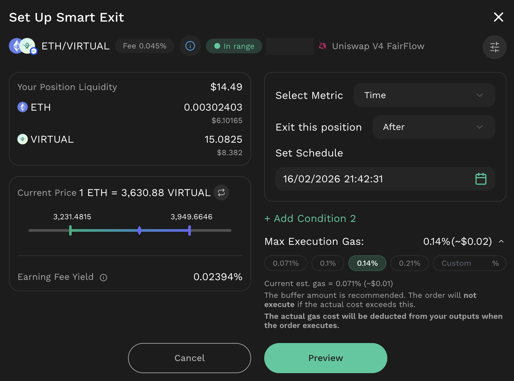
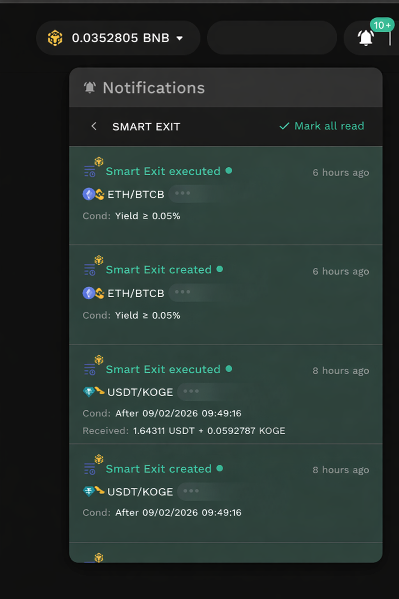

# Feature Capabilities

## Gasless order creation & cancellation

Smart Exit supports **gasless order creation and cancellation**, meaning users can create or cancel a Smart Exit order without submitting an on-chain transaction from their wallet, and without needing native gas tokens at the time of setup or cancellation. When creating an order, users define the exit conditions for a specific liquidity position, confirm the order and sign the permission, after which the system begins monitoring those conditions. When an active order is cancelled, it becomes inactive and cannot be executed.


Note: “Gasless order creation” refers to the setup step only. Gas requirements for the execution step are described separately in the [**Gas fee execution mechanism**](feature-capabilities.md#gas-fee-execution-mechanism) section.


## Execution mechanism

### Condition Mechanism

Smart Exit allows users to define one or more exit conditions, which can be used **individually** or **combined** using logical operators **AND** or **OR**.

* AND: both conditions must be met to exit.
* OR: one of two conditions can be met to exit.

When multiple conditions are combined, execution behavior depends on the selected logic, as shown below:

<table><thead><tr><th width="182.40234375">Metrics Pair</th><th>AND (ALL) Behavior</th><th>Text</th></tr></thead><tbody><tr><td>Fee Yield + Pool Price</td><td>
Exit executes only when <strong>fee yield ≥ threshold and pool price meets the target.</strong> 

Example: Fee Yield ≥ 5% <strong>AND</strong> Pool Price ≥ 1.00 → executes only when <strong>both</strong> are met at the same time.
</td><td>
Exit executes when <strong>fee yield ≥ threshold or pool price meets the target.</strong> 

Example: Fee Yield ≥ 5% <strong>OR</strong> Pool Price ≥ 1.00 → executes when <strong>either</strong> condition is met, whichever occurs first.
</td></tr><tr><td>Fee Yield + Time</td><td>
Exit executes only when <strong>fee yield ≥ threshold and time condition is met.</strong> 

Example: Fee Yield ≥ 5% <strong>AND</strong> Time after 12:00 on 01/03/2026 → executes only when <strong>both</strong> are met.
</td><td>
Exit executes when <strong>fee yield ≥ threshold or time condition is met.</strong> 

Example: Fee Yield ≥ 5% <strong>OR</strong> Time after 12:00 on 01/03/2026 → executes when <strong>either</strong> condition is met, whichever occurs first.
</td></tr><tr><td>Pool Price + Time</td><td>
Exit executes only when <strong>pool price meets the target and time condition is met.</strong> 

Example: Pool Price ≥ 1.00 <strong>AND</strong> Time after 12:00 on 01/03/2026 → executes only if the price target is met <strong>after</strong> the specified time.
</td><td>
Exit executes when <strong>pool price meets the target or time condition is met.</strong> 

Example: Pool Price ≥ 1.00 <strong>OR</strong> Time after 12:00 on 01/03/2026 → executes when <strong>either</strong> condition is met, whichever occurs first.
</td></tr></tbody></table>

Note: All examples assume the order has not expired and the execution gas cap is satisfied.

#### 1. Fee Yield Condition

<figure><figcaption></figcaption></figure>

Fee Yield condition triggers an exit when the fee yield earned by the position reaches (or exceeds) a user-defined threshold. Fee yield is calculated in **token-based** and is computed based on fees earned **from the time the position is created**. The value shown and selected in the interface is the **percentage yield**, calculated using the formula below.

$$
percentage Yield = \frac{f₀ + \frac{f₁}{P}}{t₀ + \frac{t₁}{P}}*100
$$

Where:

* _f0, f1_ : fees earned for Token₀ and Token₁, accumulated from the time the position was created.
* _t0, t1_: the initial deposited amounts of Token₀ and Token₁ when adding liquidity.
* _P_ : the current pool price (Token₁ per Token₀)

Note:

* Use real-time pool price
* When the Fee Yield condition is satisfied, the pool price used at that time is treated as the **exitPoolPrice** for that evaluation.
* Fee yield is evaluated **in token-based** basis rather than in USD value, so the calculation reflects fees actually earned by the position, independent of external price movements. This design avoids misleading effects caused by short-term price volatility and ensures that the condition is not affected by changes in market valuation.

To help users understand their current fee earnings and set more informed strategies, the interface displays Earning Fee Yield during order setup. The value represents the percentage of fees earned from the time the position was created up to the current time, calculated based on the amount of fee tokens earned by the position relative to the initial deposit, as defined by the formula above.

<figure><figcaption></figcaption></figure>

#### 2. Pool Price Condition

<figure><figcaption></figcaption></figure>

The **Pool Price** condition triggers an exit when the pool price reaches or exceeds a user-defined threshold.

Users can set the condition as either:

* Price ≥ target (e.g., exit when the price rises to a level), or
* Price ≤ target (e.g., exit when the price falls to a level).

Note: Pool price is expressed in the pool’s quote convention (e.g., Token₁ per Token₀).

Example:

* If a user sets a condition of Pool price **≥ 1.00**, the exit will be executed at a pool price of **1.00** or slightly above the threshold, such as **1.00001**. This ensures that the threshold is enforced and that the user-defined condition (**Pool Price ≥ 1.00**) is satisfied at execution time.

#### 3. Time-based Condition

<figure><figcaption></figcaption></figure>

The **Time-based** condition triggers an exit before or after a user-specified date and time.

* Before: any time before the user-specified date and time.
* After: at or immediately after the user-specified date and time.

The Time-based condition can be used as a standalone trigger for an automatic exit **after the specified time is reached** (only after condition can be used), or combined with other conditions. When combined, the position can exit **only when both** the time requirement (before or after, as configured) and another condition are satisfied (**AND**), or exit when **either** a condition is met **or** when/after the specified time is reached (**OR**, as a fallback).

### Gas fee execution mechanism

Users do not need to hold native tokens to pay gas upfront. However, Smart Exit execution still requires an on-chain transaction and therefore incurs network gas costs. The execution transaction is submitted by an executor wallet, which pays gas upfront and is reimbursed from the user’s exit output tokens from the position. This reimbursement is limited by a user-signed maximum gas cap; if the actual gas required exceeds the cap at execution time, the order will not execute. This mechanism is designed to work across Ethereum and other EVM networks, including periods of volatile gas pricing.

**Gas cap calculation (setup-time)**

The maximum gas cap is derived from the current estimated gas cost with a buffer, expressed as a percentage of the position value:

$$c_{percentage} = \frac{100*1.5*a}{current position USD value}$$

Where:

* $c\_{percentage}$: Max execution gas cap, expressed as a percentage of the position’s USD value at setup time.
* $a$: Current estimated gas fee (USD) for executing the Smart Exit, based on the real-time gas estimate.
* 1.5: Buffer multiplier (adds a 50% buffer) to account for gas volatility.
* current position USD value: The estimated USD value of the LP position at setup time, based on current token prices.

## Order monitoring & management

Smart Exit provides an order management view where users can review and manage all Smart Exit orders created for their liquidity positions. For each order, users can view key configuration details (e.g., selected position, configured conditions, and max execution gas) and the current status. Historical orders remain available for reference, together with related execution records.

<figure><figcaption></figcaption></figure>

Smart Exit also supports notifications for key order events, including order creation, when conditions are met, and when execution is completed or cannot be executed. Notifications are delivered through the Notifications Hub on Kyberswap.com.

<figure><figcaption></figcaption></figure>

