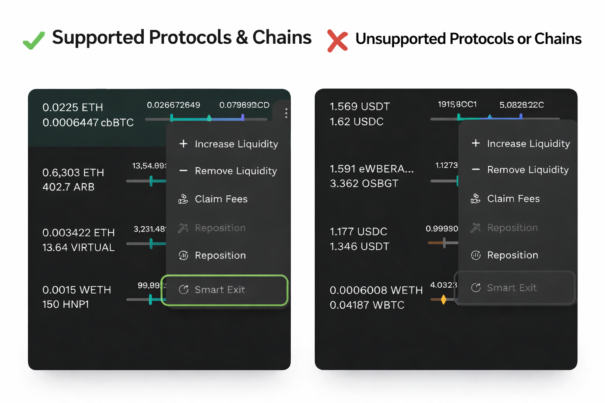
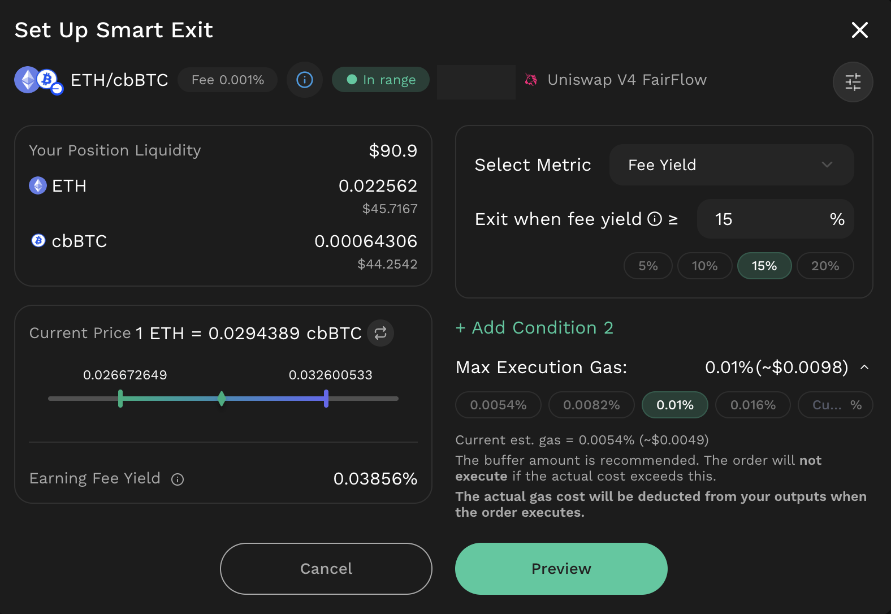
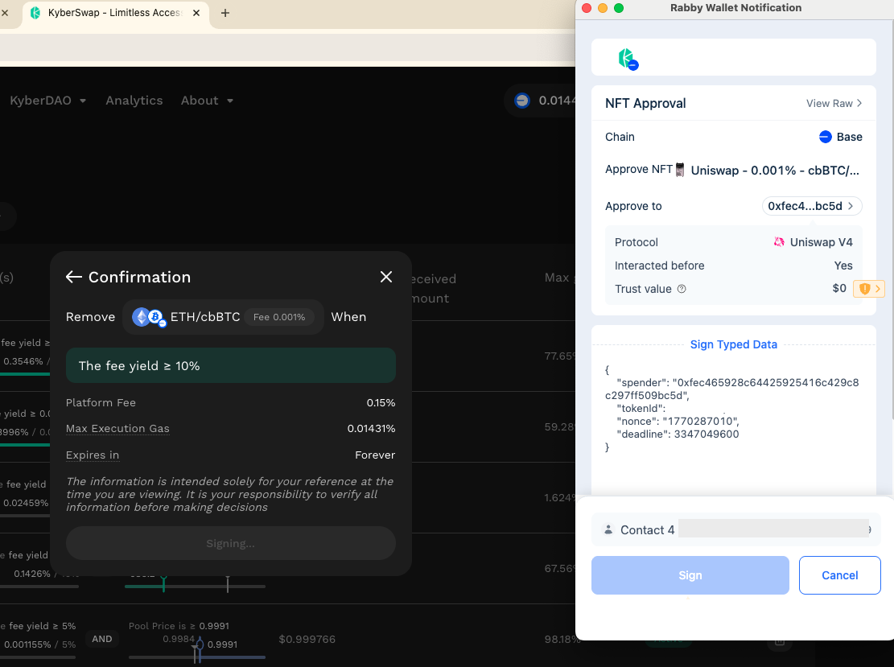

# User Guide

Smart Exit is currently available on BNB Chain and Base for the following protocols:

* Uniswap v3
* Uniswap v4 (including FairFlow)
* PancakeSwap v3
* PancakeSwap Infinity CL (including FairFlow)

_Support for chains and protocols will be updated over time._

## Create Smart Exit order

### Navigation

You can create a Smart Exit order immediately after creating a new liquidity position in **Kyber Earn**, or from an existing position on the **My Positions** page.

<figure><figcaption></figcaption></figure>

<figure><figcaption></figcaption></figure>

<figure><figcaption></figcaption></figure>

You can also click Set Up Smart Exit on Smart Exit Orders page and select the position you want to create the order for.

<figure><figcaption></figcaption></figure>

<figure><figcaption></figcaption></figure>

Smart Exit option is enabled only for positions on supported protocols and chains. For unsupported positions, the Smart Exit option will be disabled.

<figure><figcaption></figcaption></figure>

### Configure the order

[Set Exit conditions](user-guide.md#set-exit-conditions)

[Set Max execution gas](user-guide.md#set-max-execution-gas)

[Set Expiration time](user-guide.md#set-expiration-time)

<figure><figcaption></figcaption></figure>

#### **Set Exit conditions**

Define one or more conditions for exiting the position.


For details on each condition type, refer to: [Execution mechanism](feature-capabilities.md#execution-mechanism)


If multiple conditions are configured, select how they are evaluated:

* AND: the order becomes executable only when **all** configured conditions are met **and** the order has not expired.
* OR: the order becomes executable when **any one** of the configured conditions is met **and** the order has not expired.

**Example**

You have a position in ETH/USDC (Uniswap V4 FairFlow) on Base with the intended strategy:

“Exit my LP position when ETH hits $3,800 **OR** after 12:00 on 01/03/2026.”

Configuration:

* Condition 1 (Pool Price): Exit when ETH/USDC **≥** **$3,800**
* Condition 2 (Time-based): Exit this position **after** **12:00 on 01/03/2026.**
* Combine using **OR**

<figure><figcaption></figcaption></figure>

#### **Set Max execution gas**

Configure the maximum gas cap authorized for execution.

For details, refer to [**Gas fee execution mechanism**](feature-capabilities.md#gas-fee-execution-mechanism)

If the actual gas cost at execution time exceeds this cap, the order will not execute. If the user does not customize this setting, a default value recommended by the system will be applied.

<figure><figcaption></figcaption></figure>

If the actual gas cost at execution time exceeds this cap, the order will not execute. If the user does not customize this setting, a default value recommended by the system will be applied.

#### Set Expiration time

Set an expiration time for the order. After the expiration time is reached, the order becomes inactive and cannot be executed.

<figure><figcaption></figcaption></figure>

If the user does not set an expiration time, the order will default to Forever.

### Sign and confirm

Review the authorization request and sign to grant the necessary permission for Smart Exit to execute on the selected position. By signing, you agree to the conditions you have set, including the maximum execution gas and platform fee.

<figure><figcaption></figcaption></figure>

Once the signing process is complete, your order will appear in the Smart Exit order list.

Note: If the order is successfully executed, the actual gas fee and platform fee are deducted from the position’s output tokens using the following priority:

* Primary: deduct from the native token output, if available.
* Secondary: if no native token output is available, deduct from the stable token output.
* Fallback: if neither native nor stable token output is available, deduct from the token with the higher output balance (to reduce the risk of insufficient balance or rounding issues).
* Insufficient balance: if the selected token balance is still insufficient, the deduction is split proportionally across both output tokens.

### Monitor order status

After a Smart Exit order is created, its status can be tracked from the Smart Exit Orders page.

<figure><figcaption></figcaption></figure>

The order will be active until at least one condition (OR) or all conditions (AND) are met, and the order is still within its valid period.

<figure><figcaption></figcaption></figure>

While the order is active and has not been executed, users have the option to **cancel the order gaslessly.**

When **the configured exit conditions are met** and the actual gas cost at execution time is within the user-defined max gas cap, the position will be exited automatically. Users can view the order status and the execution transaction hash from the Smart Exit Orders page.

If network gas spikes and the actual gas cost exceeds the configured max gas cap, the execution transaction will not be submitted, and the order will remain unexecuted.

If an order becomes **inactive**, it will not execute. This can occur when:

* **Expired:** the order passed its configured expiry time.
* **Cancelled:**
  * The position was modified (e.g., liquidity was increased, reduced, or fully removed)
  * The order was manually cancelled by the user.
  * The position state changed (e.g., the position NFT was transferred to another wallet or the position was staked).

## Fee Structure

To support the continued development and maintenance of the Smart Exit, KyberSwap applies a platform fee for using this feature. When reviewing a Smart Exit order, the applicable platform fee is displayed as “Platform Fee” in the Confirmation section before the order is confirmed.

<figure><figcaption></figcaption></figure>

Below is the detailed fee structure:

<table><thead><tr><th width="169.5546875">Pair Category</th><th width="184.69140625">Platform Fee</th></tr></thead><tbody><tr><td>Stable pair</td><td>0.025%</td></tr><tr><td>Correlated pair</td><td>0.05%</td></tr><tr><td>Common pair</td><td>0.15%</td></tr><tr><td>High volatility pair</td><td>0.75%</td></tr><tr><td>Exotic pair</td><td>0.3%</td></tr></tbody></table>

The platform fee is deducted from the position’s output tokens at execution. For details on the deduction mechanism, refer to [Sign and confirm](user-guide.md#sign-and-confirm).

Pair category definition

**Stable pair**

Token pairs that composed of stablecoins or assets designed to maintain a stable value relative to each other (e.g., USDC/USDT).

**Correlated pair**

Token pairs are strongly correlated or derivatives of each other. This includes derivative tokens (e.g., liquid staking tokens representing staked ETH) or tokens minted from one another (e.g., WETH/wstETH).

**Common pair**

Token pairs composed of widely adopted assets, defined as tokens within the top 50 by market capitalization (≥ USD 100M market cap) on each chain. This information can be referenced from the Market Overview or other reliable data sources.

**Exotic pair**

Token pairs that are not covered under the stable, correlated, or common pair categories.

**High volatility pair**

Token pairs that include tokens added to the Token Catalog within the past 1 month.

