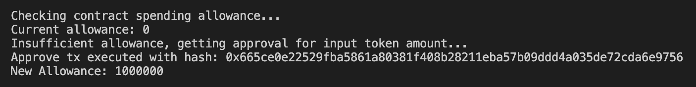
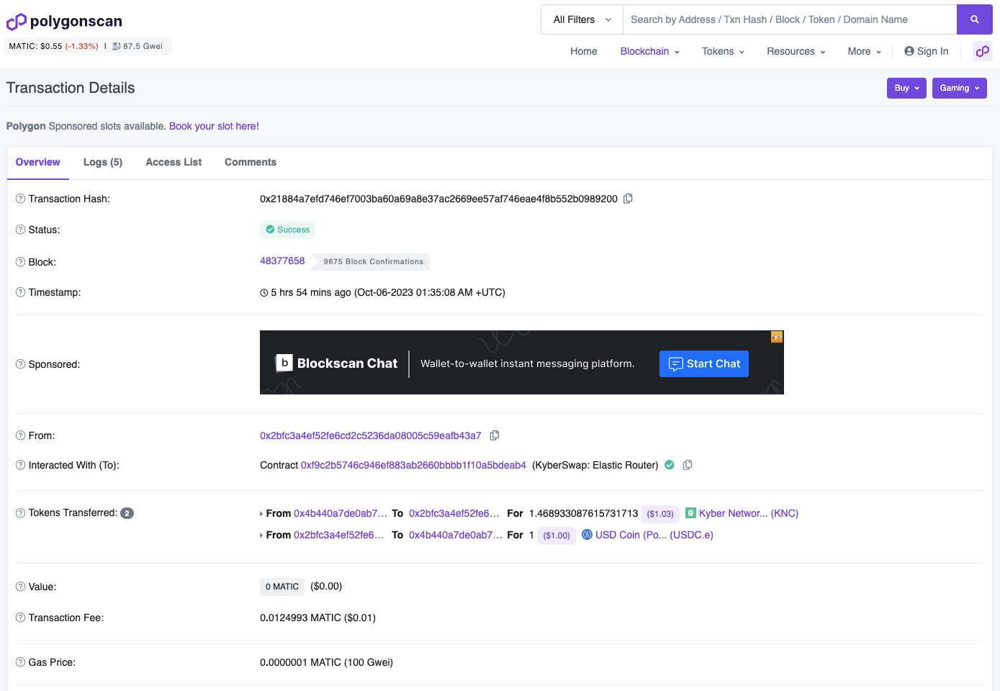

# Execute A Trade

## Introduction

This guide builds upon the quote that was obtained from the [Get A Quote](get-a-quote.md) sample. To execute the swap via the [Elastic Router contract](../../kyberswap-elastic/contracts/elastic-contract-addresses.md), we will first need to construct the trade call using the returned quote parameters. Additionally, the Router contract must also be able to spend the specified amount of input tokens from the owner's wallet hence requiring approval ([ERC20 Approve](https://docs.openzeppelin.com/contracts/4.x/api/token/erc20#IERC20-approve-address-uint256-)) to be provided.

The logic for executing a trade can be found in the `trade.ts` file linked below:




**Signer configuration**

In order to sign the transaction to be processed by the network, this example requires an [Ethers Signer](https://docs.ethers.org/v6/api/providers/#Signer) to be configured. Please view [Provider and Signer](environment-setup.md#provider-and-signer-setup) Setup for more information.


## Flow

1. [Approve Router contract spending](execute-a-trade.md#step-1-approve-router-contract-spending)
2. [Create unchecked trade and configure swap options](execute-a-trade.md#step-2-create-unchecked-trade-and-configure-swap-options)
3. [Get trade calldata from SwapRouter class](execute-a-trade.md#step-3-get-trade-calldata-from-swaprouter-class)
4. [Execute the swap](execute-a-trade.md#step-4-execute-the-swap)

## Executing A Swap

### Step 1: Approve Router contract spending

In order to execute the trade, the Router contract must have the necessary allowance to spend the specified tokens from the signer's address. We first query the token contract to check the existing Route contract allowance:

```typescript
const contractAllowance = await token0Contract.allowance(signerAddress, elasticContracts.ROUTER);
```

If the Router contract allowance is insufficient, we will sign an approve transaction for the exact amount of input tokens required for the trade. This is executed via the [`getTokenApproval()`](https://github.com/KyberNetwork/ks-sdk-elastic-demo/blob/26d7e412409c780cd0be4835c51427b9727ae0f5/src/operations/trade.ts#L75) function which:

* Calls the [ERC20 Approve](https://docs.openzeppelin.com/contracts/4.x/api/token/erc20#IERC20-approve-address-uint256-) method of the Token's contract

```typescript
const approvalTx = await token0Contract.approve(
    elasticContracts.ROUTER, 
    BigInt(inputAmount.quotient.toString()), 
    {maxFeePerGas: 100000000000, maxPriorityFeePerGas: 100000000000}
    );
```

* Waits for the Approve transaction to be executed

```typescript
const approvalTxReceipt = await approvalTx.wait();
```

* Queries the new Router allowance for confirmation

```typescript
const newContractAllowance = await token0Contract.allowance(signerAddress, elasticContracts.ROUTER)
```

A transaction hash will be returned upon successful approval:

<figure><figcaption></figcaption></figure>

### Step 2:  Create unchecked trade and configure swap options

Once we have the required allowance, we can then start to construct the trade. We first create an unchecked trade using the returned route:

```typescript
const tradeConstructorArgs = {
    route,
    inputAmount,
    outputAmount,
    tradeType
};
const uncheckedTrade = Trade.createUncheckedTrade(tradeConstructorArgs);
```

Note that [`createUncheckedTrade()`](../classes/trade.md#createuncheckedtrade-public-static) does not validate the result of swapping through the route and is meant to be used when trade simulation has been done elsewhere. In our case, we have already queried the Quoter contract.

In addition to the trade inputs, we will also need to configure the swap options:

```typescript
const swapOptions: SwapOptions = {
    slippageTolerance: new Percent(500, 10000), // 50bips or 0.50%
    deadline: Math.floor(Date.now() / 1000) + 60 * 10, //10 mins
    recipient: signerAddress
};
```

Always remember to configure a `slippageTolerance` for your swap else risk your trade being front-run by bots via [MEV](../../../getting-started/foundational-topics/decentralized-finance/maximal-extractable-value-mev.md).

### Step 3: Get trade calldata from SwapRouter class

With the trade parameters in place, we can then use the [SwapRouter](../classes/swaprouter.md) class to generate the calldata required for the trade:

```typescript
const swapMethodParams = SwapRouter.swapCallParameters([uncheckedTrade], swapOptions);
```

### Step 4: Execute the swap

Finally, we can execute the trade by sending the transaction to the network with our Signer instance:

```typescript
const swapTx = await getSigner().sendTransaction({
    data: swapMethodParams.calldata,
    to: elasticContracts.ROUTER,
    value: swapMethodParams.value,
    from: signerAddress,
    maxFeePerGas: 100000000000,
    maxPriorityFeePerGas: 100000000000
});
```

A transaction has will be returned once the trade has been executed. You can copy this hash into a scanner (i.e. [PolygonScan](https://polygonscan.com/)) and see that your transaction has been successfully completed by the network.

<figure><figcaption><p><a href="https://polygonscan.com/tx/0x21884a7efd746ef7003ba60a69a8e37ac2669ee57af746eae4f8b552b0989200">Sample trade executed on Polygon</a></p></figcaption></figure>
