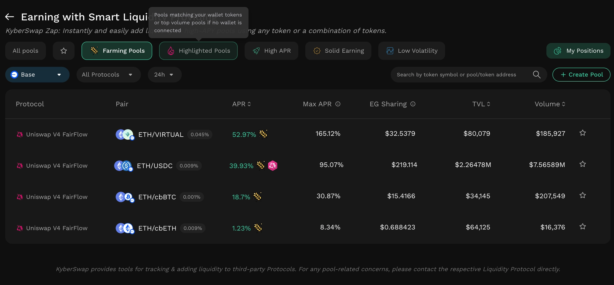
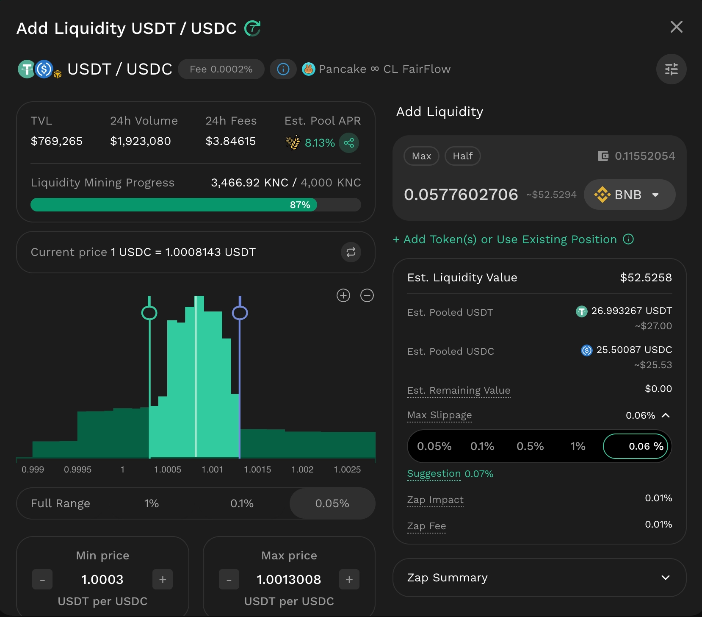
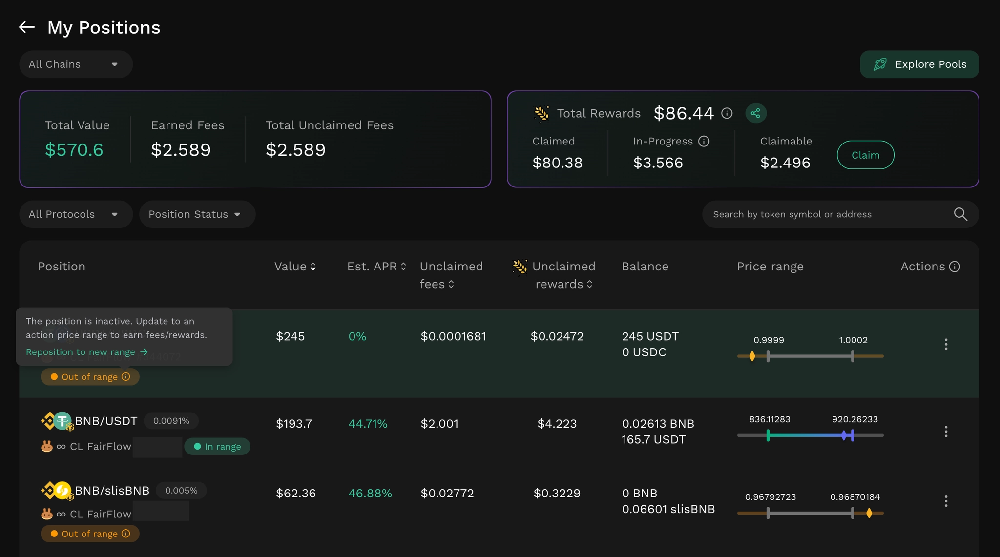

# Kyber Earn

## Introduction

### Overview

[Kyber Earn](https://kyberswap.com/earn) is a streamlined, all-in-one platform designed to help users easily access and manage yield-generating opportunities across multiple liquidity protocols. By aggregating top-tier liquidity protocols - including Uniswap V3, Uniswap V4, PancakeSwap, Aerodrome, and SushiSwap, etc. - Kyber Earn provides a single interface where users can seamlessly explore, compare diverse earning opportunities, enter positions with ease, and easily track and manage their positions.

The platform abstracts the fragmentation of DeFi, allowing users to conduct deep yield discovery; execute single-click deposits from any held assets using dynamic trade routing optimized for the best swap rates, minimal price impact, and complex fallback logic ([KyberZap](../../developer-guide/zap-as-a-service-zaas-api/)); and actively manage complex liquidity positions across multiple chains from a single interface.


Kyber Earn does not operate liquidity pools directly. It provides tooling to interact with pools on third-party protocols, currently including Uniswap V3, Uniswap V4, PancakeSwap, Aerodrome, and SushiSwap, among others. For a comprehensive list of supported chains and protocols, refer to [Supported Exchanges And Networks](../../getting-started/supported-exchanges-and-networks.md).


### **Integrated Technologies**

[KyberZap (Zap as a service)](../../developer-guide/zap-as-a-service-zaas-api/) is the transaction execution layer used for all deposit, migration, repositioning, compounding, and single-asset withdrawal (Zap Out) operations within Kyber Earn. For Zap In operations, it accepts a basket of input tokens, computes the swap path required to reach the reserve ratio of the target pool and price range, executes the swaps via the KyberSwap Aggregator internally, and submits the liquidity deposit. For Zap Out, it withdraws the position and consolidates the resulting assets into a single target token via the KyberSwap Aggregator.

Key properties:

* Accepts up to 5 distinct input tokens per Zap In transaction — an industry-first capability for concentrated liquidity deposits.
* All swaps are routed internally through the KyberSwap Aggregator, optimizing for rate, price impact, and gas efficiency.
* KyberZap employs fallback logic to simulate alternative swap routes and execute additional swaps if needed, maximizing capital usage even in volatile market conditions.

## Key Benefits

### Earning Opportunities Discovery & Analytics

<figure><figcaption></figcaption></figure>

Navigating fragmented liquidity markets requires precise, on-chain data. Kyber Earn acts as a centralized intelligence hub, aggregating pools across prominent protocols (e.g., Uniswap V3/V4, PancakeSwap, Aerodrome) and dynamically categorizing them to align with specific LP risk profiles.

* **Real-Time Metrics:** Evaluate earning opportunities using real-time data, including APR, fee earned, TVL and volume.
* **Targeted Segmentation:** Instantly identify optimal setups tailored to your specific risk profile and market outlook. Kyber Earn systematically filters pools into distinct classifications, allowing liquidity providers to rapidly deploy targeted market-making strategies:
  * **Low Volatility:** Designed for risk-averse liquidity providers seeking to minimize impermanent loss. This category highlights pools consisting of stablecoins or highly correlated assets, offering steady yield with minimal price divergence.
  * **High APR:** Geared toward risk-tolerant liquidity providers looking to maximize capital efficiency. This segment identifies pools offering exceptionally high aggregate yields, compensating for the increased price volatility with aggressive trading fees and protocol emissions.
  * **Solid Earning:** Tailored for data-driven liquidity providers seeking proven market activity. This category filters for pools that have generated the highest trading fees over a trailing 7-day period, indicating deep, consistent routing volume and strong organic utilization.

### Single-Transaction Capital Deployment via KyberZap

<figure><figcaption></figcaption></figure>

Traditionally, entering a concentrated liquidity position requires precise, manual asset balancing and multiple smart contract interactions. Kyber Earn eliminates this friction through its proprietary [**KyberZap technology (Zap as a Service)**](../../developer-guide/zap-as-a-service-zaas-api/).

* **Frictionless Entry & Migration:** Supply liquidity using a custom basket of up to 5 distinct tokens directly from your wallet, or execute an atomic "Zap Migrate" to instantly move capital from an existing position into a new pool.
* **Automated Asset Routing & Deposit:** KyberZap leverages the underlying [KyberSwap Aggregator ](../../developer-guide/aggregator-api/)to automatically swap input tokens into the exact ratios required by the target pool's price range. This ensures minimal price impact, optimized gas usage, and maximum capital efficiency without requiring manual calculations.

### Comprehensive Portfolio & Risk Management

<figure><figcaption></figcaption></figure>

Active liquidity management requires continuous oversight. Kyber Earn replaces fragmented protocol tracking with a consolidated LP dashboard.

* **Unified Oversight:** Track the pool performance and accrued fees and rewards of all your liquidity positions across multiple chains and protocols from a single interface.
* **Active Range Monitoring & Adjustment:** Easily monitor whether your concentrated liquidity positions remain within their active tick ranges to ensure continuous fee generation. If the market shifts, liquidity providers can quickly trigger **a** **reposition** **action** to realign their capital with the new price range. Kyber Earn automatically withdraws the current position including claiming accrued fees, rebalances the underlying assets to fit the new range, and redeposits them - all within a single, atomic transaction.
* **Automated Risk Mitigation (Smart Exit):** Smart Exit allows liquidity providers to establish predefined market conditions (such as specific price triggers) to automatically execute a liquidity withdrawal. This conditional logic acts as a vital stop-loss mechanism to shield portfolios from extreme volatility and runaway impermanent loss. See the [Smart Exit documentation](../smart-exit/) for full details.

## Core Capabilities

[Kyber Earn](https://kyberswap.com/earn) provides a unified interface for interacting with supported liquidity pools and managing yield-generating positions. The following core capabilities are available to users:

#### **Position Creation**

* **Single/Multi-Asset Zap In:** Supply liquidity using a single or multiple tokens (up to 5) of the user’s choice; the inputted assets do not need to correspond to the target liquidity pair. The protocol handles the necessary underlying swaps by leveraging KyberSwap Aggregator to match the pool's required reserves with minimal price impact.
* **Zap Migrate:** Execute an atomic migration of capital. Users can exit a position and instantly add those funds into a new pool in a single transaction sequence.

#### **Position Management, Increase Liquidity and Reposition**

Kyber Earn enables users to view and manage existing position performances through “[My Positions](https://kyberswap.com/earn/positions)” dashboard.

* **Performance Tracking:** Granular, real-time tracking of accrued trading fees, [FairFlow](../kyberswap-fairflow/) rewards, and position status (in-range vs. out-of-range).
* **Increasing Liquidity using Zap In:** Increase the size of an existing position by zapping in additional assets. The protocol automatically calculates the exact token ratio required by your specific price range and handles the underlying conversions for you, with the same execution flow as a standard Zap In.
* **Repositioning:** Adjust to market volatility by moving liquidity to a new price range. Kyber Earn executes the fee claiming and liquidity withdrawal, necessary asset rebalancing, and redepositing into the new tick range seamlessly.

#### **Fee and Reward Management**

Users can view and manage fees and rewards generated by their liquidity positions directly within Kyber Earn.

* **Claiming:** Accrued trading fees can be claimed per position at any time from the My Positions dashboard.
  * FairFlow rewards are separate from trading fees and governed by a vesting schedule. The accumulated reward amount becomes claimable after the vesting period concludes at the end of each FairFlow cycle. Refer to the [FairFlow documentation](../kyberswap-fairflow/) and information on the interface for cycle timing and claim details.
* **One-Click Compounding:** Automatically reinvest accrued fees for each position back into the core principal of the corresponding position in one transaction, maximizing the effects of compound interest without manual asset swapping.

#### **Advanced Exit Strategies**

Users have flexible options to withdraw their capital, tailored to specific market conditions and risk parameters:

* **Zap Out (Single Asset):** Withdraw partially or fully remove a position, then automatically swap the underlying pool assets into a single target token of your choice. This operation is powered by KyberZap, which routes the consolidation swap through the KyberSwap Aggregator to minimize price impact.
* **Standard Withdrawal:** Withdraw partially or fully remove a position manually, receiving the underlying pool assets in their current ratio, no additional swaps. Accrued fees are collected in the same transaction.
* [**Smart Exit**](../smart-exit/) (Industry-First Intent-Based Liquidity Withdrawal):\*\* Leverage a unique, intent-based market solution to conditionally remove liquidity. Rather than monitoring active ticks 24/7, users simply define specific exit conditions. Liquidity is withdrawn only when these specific conditions are triggered, ensuring execution is strictly enforced and fully verifiable via public smart contracts.
  * **Example scenario:** An LP holds a ETH/USDC position with a price range of $2,200–$2,800. They submit a Smart Exit condition to trigger if the ETH price drops below $2,100 or after 12:00, April 1, 2026. If the on-chain ETH price is ≤ $2,100, the Smart Exit contract withdraws the position and returns the pool assets to the LP’s wallet, limiting further impermanent loss exposure below that level. If the price condition is never met, the position is automatically withdrawn at or after 12:00 on April 1, 2026.
  * Notes:
    * Submitting, cancelling, and modifying Smart Exit conditions are handled off-chain - no gas is required for these actions. The only on-chain transaction occurs when exit conditions are triggered and the position withdrawal is executed.
      *   Smart Exit returns assets in the pool token ratio. It does not consolidate into a single token - an automatic Zap Out as part of the Smart Exit flow is not currently supported.

          For comprehensive technical details and guidelines, you can refer to: [Smart Exit documentation](../smart-exit/).


Before confirming any Zap operation (Zap In, Zap Out, Migrate, or Reposition), always review the quoted output, slippage, Zap impact, and applicable fees displayed in the interface.


#### **Permissionless Pool Creation**

* **Custom Pool Creation:** If a desired pair and fee tier do not exist, users can initialize a new liquidity pool directly through the Kyber Earn interface using any combination of up to 5 tokens, setting the foundational liquidity parameters for the market.


Disclaimer: KyberSwap provides tools for tracking and managing liquidity on third-party protocols. KyberSwap does not operate, control, or guarantee the performance of any third-party pool. Any pool-related concerns should be directed to the corresponding protocol.


### Platform fee

All operations executed through [the KyberZap contract](../../developer-guide/zap-as-a-service-zaas-api/contracts-and-addresses.md) incur a platform fee. The fee is charged on the input amount and varies based on the specific token pair category. The applicable fee amount is transparently displayed in the interface for review prior to transaction confirmation.

Refer to [Fee Structure](../fee-schedule.md) for further details.

**Ready to start earning?** [Explore pools on Kyber Earn](https://kyberswap.com/earn) and manage all your LP positions from one place.
