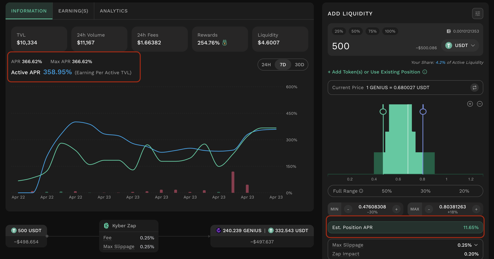

# APR Metrics

## Introduction

Kyber Earn provides five APR metrics across the pool explorer and position management interfaces. These metrics provide liquidity providers with a layered view of earning potential, ranging from pool-level indicators to position-specific estimates.

Most DeFi platforms display a single pool APR based on total value locked (TVL). Kyber Earn introduces additional metrics that account for active liquidity, position range, and projected reward distribution. This provides a more precise estimate of potential returns for individual positions.

<figure><figcaption></figcaption></figure>

<table data-header-hidden><thead><tr><th width="206.72265625"></th><th></th></tr></thead><tbody><tr><td><strong>Metric</strong></td><td><strong>What it represents</strong></td></tr><tr><td>Est. Pool APR</td><td>Annualized return based on total fees earned by the pool over the selected time window (24h, 7d, or 30d), relative to total pool TVL. Serves as the standard baseline metric for comparing pool performance.</td></tr><tr><td>Active APR</td><td>Annualized return based on earnings relative to active TVL only - liquidity currently within the price range. Excludes out-of-range capital from the denominator.</td></tr><tr><td>Max APR</td><td>The highest APR observed across all positions in the pool. Represents the return ceiling for a strategically placed position.</td></tr><tr><td>Est. Position APR</td><td>Estimated annualized return for a new position at a selected price range. Based on projected fee earnings and applicable rewards under current conditions. Provided for reference only and does not guarantee future returns.</td></tr><tr><td>Est. My Position APR</td><td>Annualized return of an existing position, calculated from fees earned relative to its current value over the selected time window. Reflects realized performance.</td></tr></tbody></table>

## How APR(s) are calculated

### Estimated Pool APR

Estimated Pool APR measures the annualized return of the pool as a whole, based on total fee earnings relative to total pool TVL over a selected time window. It is the standard baseline metric used across most DEX interfaces and serves as a quick, comparable signal of overall pool productivity.

$$
Position\ APR \ (24h)= \frac{Fee\ earned\ in\ 24h}{Current\ liquidity\ value}*365*100\%
$$

<figure><figcaption></figcaption></figure>

<figure><figcaption></figcaption></figure>

#### When to use it

Pool APR is most useful as a first-pass filter when browsing pools - it quickly surfaces high-activity pools versus low-volume ones. For evaluating what a specific concentrated liquidity position is likely to earn, Active APR and Est. Position APR are more meaningful.

### Active APR

Active APR measures the annualized return of liquidity that is currently in range and actively earning trading fees. Unlike a standard pool-wide APR, Active APR uses only the active TVL - liquidity deployed within the current price range — as the denominator. This means out-of-range liquidity does not dilute the metric, making it a more accurate signal of real earning efficiency for concentrated liquidity positions.

_Active APR can appear significantly higher than a traditional pool APR because out-of-range capital is excluded from the denominator. A high Active APR indicates that in-range liquidity has been earning efficiently, not necessarily that the pool has high total volume._

#### How to calculate

Every 15 minutes, the system records two values for the interval:

* $$E_i$$: Fees earned during that 15-minute interval
* $$TVL_i$$: Active TVL (in-range liquidity only) at the end of that interval

Active APR is the sum of per-interval fee-to-active-TVL ratios over the trailing 24 hours, annualized:

$$
APR_{active}=\sum_{i\  in\  24h} (\frac{E_i}{TVL_i}) *365 *100 \%
$$

The trailing 24-hour window contains up to 96 data points (one per 15-minute interval). If fewer than 96 points are available - for example, if the pool was recently created or data points were excluded due to abnormal activity — the result is scaled proportionally to normalize for the missing intervals:

$$
APR_{active}=\sum_{i\  in\  24h} (\frac{E_i}{TVL_i})* \frac{96}{k} *365 *100 \%
$$

<figure><figcaption></figcaption></figure>

<figure><figcaption></figcaption></figure>

#### When to use it

Active APR is most useful when comparing pools where you intend to keep your position in range. It reflects how efficiently a pool has been generating fees relative to capital that was actually earning - a more reliable indicator than TVL-diluted metrics that include idle, out-of-range liquidity.

### Max APR

Max APR is the highest position APR observed across all positions in the pool at a given time. It represents the return ceiling - what the best-positioned LP in the pool has been earning - and is useful for understanding the potential upside of a tightly ranged concentrated liquidity position.

$$
Position\ APR \ (24h)= \frac{Earning\ in\ 24h}{Current\ position\ value}*365*100\%
$$

Max APR is then the maximum Position APR across all positions in the pool at the time of calculation.

_Max APR reflects the APR of the single best-performing position in the pool, not an average. It should be read as an upper bound, not a typical or expected return._

<figure><figcaption></figcaption></figure>

#### When to use it

Max APR is useful for two purposes:

* Understanding the return ceiling of a pool - the maximum a well-positioned LP has achieved.
* Comparing the gap between Active APR and Max APR. A large gap indicates that fee distribution is highly concentrated: a narrow price range captures significantly more fees, but carries higher out-of-range risk if the price moves beyond that range. A small gap suggests fees are distributed more evenly across positions.

### Estimated Position APR based on selected range

The Position APR Estimation feature - currently implemented in FairFlow farming pools - displays an Estimated Position APR when users select their desired price range during the liquidity provision process. This estimation reflects the potential annual returns from three key components: Liquidity Pool (LP) Fees, Equilibrium Gain (EG) rewards, and Liquidity Mining (LM) incentives.

For further details, refer to [Position APR Estimation](../kyberswap-fairflow/position-apr-estimation.md).

<figure><figcaption></figcaption></figure>

### Estimated My Position APR

My Position APR is an estimated annualized return for an existing open position, calculated from the fees and rewards that position has actually earned over the selected time window (24h or 7d) relative to its current value.

Unlike other pool-level metrics, Position APR is specific to a single LP's position. It reflects what that position has actually earned. This makes it the most relevant metric for evaluating whether an existing position is performing efficiently.

$$
Position\ APR \ (24h)= \frac{Earning\ in\ 24h}{Current\ position\ value}*365*100\%
$$

The time window is selectable: 24h or 7d. The annualization factor adjusts accordingly.

<figure><figcaption></figcaption></figure>

<figure><figcaption></figcaption></figure>

#### When to use it

Position APR is most useful for evaluating the ongoing efficiency of an open position over recent history. Comparing your Position APR against the pool's Active APR indicates whether your specific range is earning at, above, or below the pool's in-range average. A Position APR significantly below Active APR is a signal that **repositioning** may improve returns.
