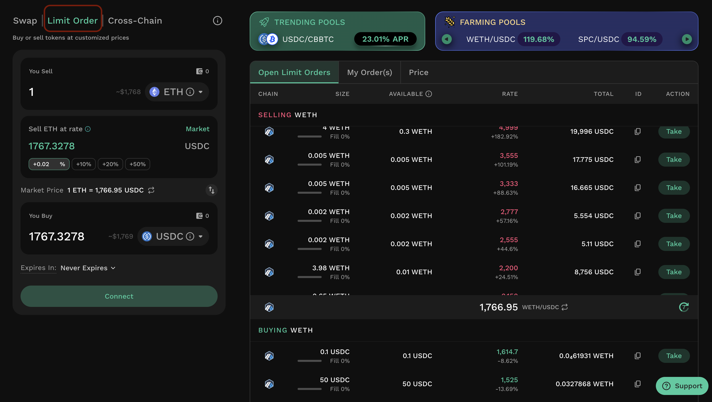
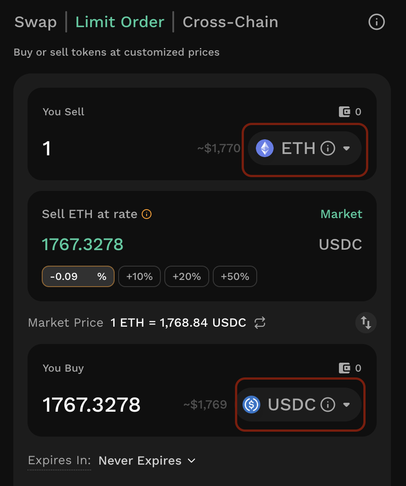
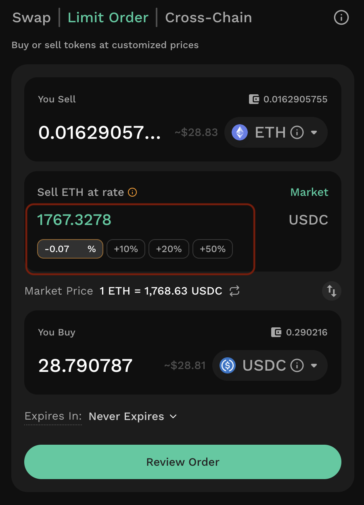
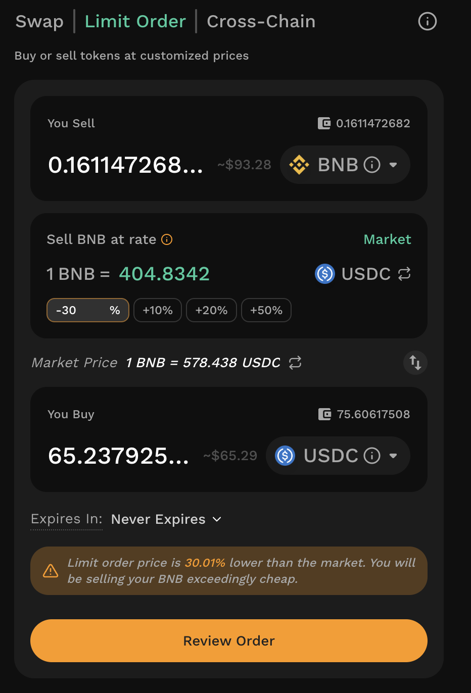
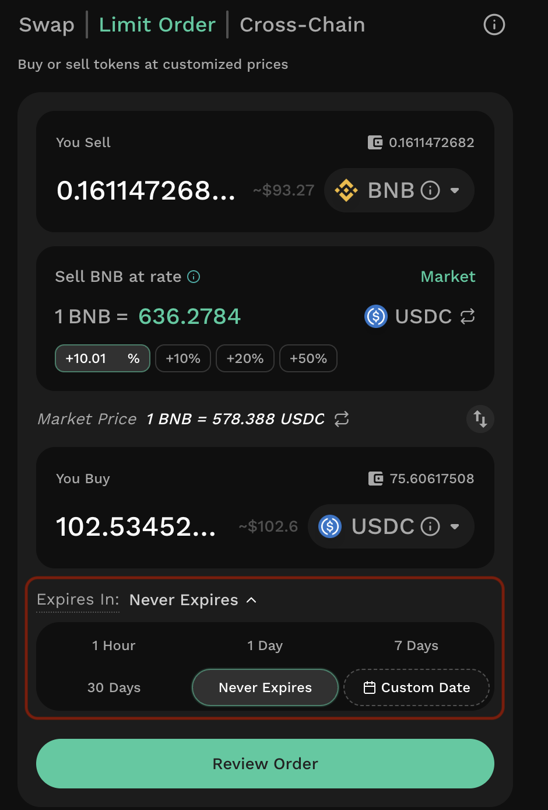
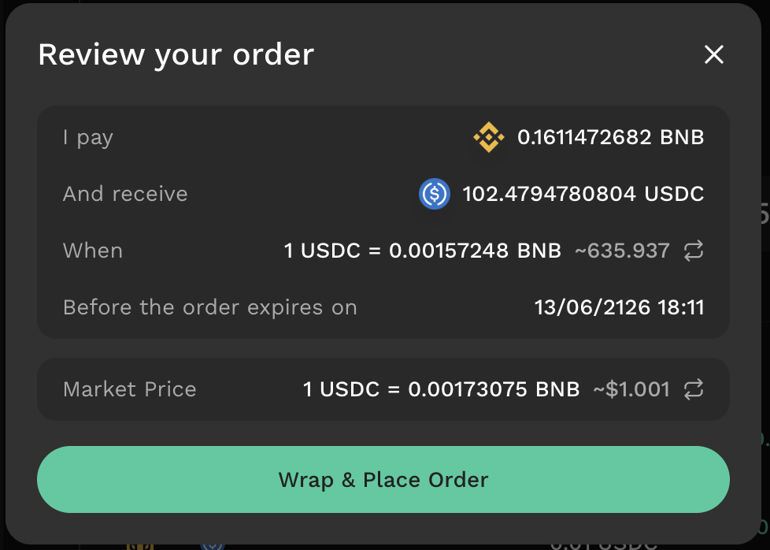
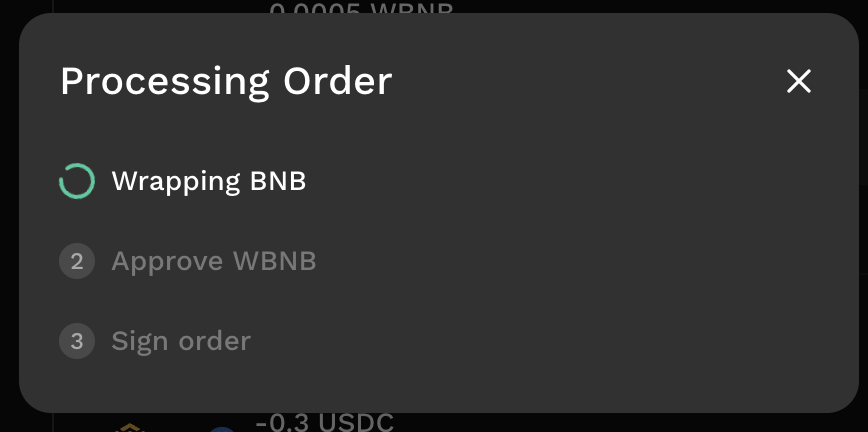
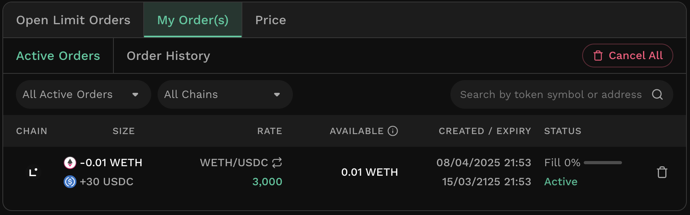

# Create Limit Orders

A [**Limit Order** ](../../kyberswap-solutions/limit-order/)is a way for KyberSwap traders to swap tokens at a specified price or better. This stipulation allows you to have better control over your prices and capital efficiency. Limit orders are not sent to any specific user, but can instead be filled by anyone, including the KyberSwap aggregator. You can also create [limit orders via KyberSwap APIs](../../developer-guide/limit-order-api/how-to-guides/place-a-limit-order.md). When the market price matches the price set in the limit order, a **taker** can fill it. When a taker fills the order, the taker pays the gas fees associated with the transaction.

### **Step 1: Connect your wallet**

[Connect your Web3 wallet to KyberSwap](https://support.kyberswap.com/hc/en-us/articles/13757914421273) and select the network that you would like to use for the swap using the selector at the top right of the Swap page.

### **Step 2**: Navigate to the limit order page

From the Swap page, click the “Limit Order” tab. This brings up the limit order interface.

<figure><figcaption></figcaption></figure>

### **Step 3**: Specify your swap pair

Specify the token pair to use for the transaction.

<figure><figcaption></figcaption></figure>


**Fee-on-transfer tokens**

Note that certain ERC20 token smart contracts implement a fee-on-transfer (FOT) mechanism whereby for every token transfer, a percentage of the tokens are burned or distributed to various wallets. As a permissionless dapp, KyberSwap enables users to [Add Their Favourite Tokens](../user-guides/add-your-favourite-tokens.md) and hence do not limit the type of tokens traded as long as the token follows the [ERC20 standard](https://docs.openzeppelin.com/contracts/4.x/erc20).

Specific to limit orders, tokens are transferred after a maker order has been matched with a taker order (not including FOT tax). As such, the party that incurs the FOT tax will be dependent on the direction of the swap:

* **Output token**: In the case whereby a standard token is being traded for a FOT token, the FOT token is being transferred from the maker to the taker. Maker will receive the standard token less the swap fees while taker will receive the FOT token minus the swap fees AND FOT tax.
* **Input token**: In the case whereby a FOT token is being traded for a standard token, the FOT token is being transferred from the taker to the maker. Maker will receive the FOT token less the swap fees AND fee-on-transfer while taker will receive the standard token minus the swap fees.

For a swap between two FOT tokens, the FOT tax will be incurred by both parties. If the limit order is filled via the [KyberSwap Aggregator](../../kyberswap-solutions/kyberswap-aggregator/), there will be an additional token hop via the aggregator smart contract hence the FOT tax will also be charged on the additional hop.

Note that the FOT tax is specified in the FOT token's smart contract (i.e. the FOT token team) hence KyberSwap does not have any control over the FOT mechanism. Users are advised to trade such tokens at their own risk as KyberSwap was optimized to handle the standard ERC20 implementation.


### **Step 4**: Configure your order amount

Specify the amount you would like to offer by typing in an amount manually into the “You Pay” field. Please ensure that your wallet balance is sufficient to cover the swap offer.

<figure><figcaption></figcaption></figure>

### **Step 5**: Configure your order price

Set the price by manually entering a price at the “Sell \[token] at rate”. This calculates an estimate of the amount you will receive in the "You Buy" field. KyberSwap also shows how much more favourable or unfavourable the specified rate is relative to the current market price, expressed as a percentage.

Instead of entering a rate manually, you can set your price relative to the current market price. Enter a percentage in the percentage field, or select one of the quick presets (+10%, +20%, +50%), and the corresponding rate is calculated for you. You can also select "Market" to use the current market price directly.

<figure><figcaption></figcaption></figure>


**Taker gas fees and filling of orders**

KyberSwap LO uses an [off-chain relay, on-chain settlement](../../kyberswap-solutions/limit-order/concepts/off-chain-relay.md) mechanism which enables makers to create orders without requiring gas fees to be paid. However, takers of an order will have to incur a gas fee to settle the order on-chain. Depending on the chain where the LO is taking place, these gas fees could result in smaller trades being unprofitable.

For example, if it costs a taker 40USD in gas fees to settle an Ethereum LO on-chain, takers will unlikely execute smaller volume trades due to the transaction costs. As such, maker LOs with lower volumes will likely not be filled unless the price diverges significantly enough to justify a taker's gas fees. This effect is less pronounced on other chains where gas fees tend to be negligible.

To help you set a realistic price, KyberSwap displays a warning when the order's rate differs from the current market price by 30% or more, as such orders are less likely to be filled.



### **Step 6**: Specify the time limit of your order

If your order is not filled by the end of this time limit, it will be automatically cancelled. You can either select from a list of set times or specify a custom expiry time and date. Note that you can still manually [cancel your order](cancel-limit-orders.md) (or any unfilled portion of your order) before it expires.

<figure><figcaption></figcaption></figure>

### **Step 7:** Review and place your order

Once you have configured the order amount, price, and expiry, click "Review Order" to open the "Review your order" screen. This summarises what you will pay, what you will receive, the order rate, and the expiry date and time, alongside the current market price for reference.

When you are satisfied with the details, click "Place Order" to proceed. If the token being sold is a native token (such as ETH, BNB), the button reads "Wrap & Place Order", as the native token is first converted to its wrapped ERC20 form as part of the process.

<figure><figcaption></figcaption></figure>

### Step 8: Complete the order steps

After you place the order, a "Processing Order" screen guides you through the required steps in sequence. Depending on the token and your existing approvals, these may include:

<figure><figcaption></figcaption></figure>

* **Wrapping \[token]** — shown only when selling a native token, converting it to its wrapped ERC20 form.
* **Approve \[token]** — granting the KyberSwap contract permission to transfer the token. This is a one-time action per token and is skipped on subsequent orders.
* **Sign order** — signing the order to place it.

Wrapping and approval are on-chain transactions that require gas. Signing the order itself does not require gas, as KyberSwap limit orders use an off-chain relay, on-chain settlement mechanism. If a step fails, you can retry from that step; steps already completed do not need to be repeated.


**Asset balances and token allowance**

By setting a token allowance, you authorise the KyberSwap contract to transfer this token from your wallet on your behalf when a limit order is settled. Granting an allowance does not move or lock any tokens by itself; it only permits the contract to transfer the token, up to the approved amount, at the time of settlement.


Once the order has been placed, it appears in the Active Orders screen of the interface. You can select an individual order to view the price history for the order pair. When an order is _completely_ filled, it moves to the Order History tab.

<figure><figcaption></figcaption></figure>


**Limit order and wallet balances**

Tokens committed to a limit order remain in the maker's wallet and are only transferred when a matching taker order is settled on-chain. Until the order is executed, these tokens stay available in the wallet and may be used as usual.

If the wallet holds insufficient tokens at the time of execution - for example, because the committed tokens have since been moved or spent — the order can only be filled up to the amount then available in the wallet. If no balance is available, the order will not be filled. The fillable amount is therefore limited by the tokens actually held in the maker's wallet at the time of settlement.

A limit order can only be created if the maker holds a sufficient token balance in their wallet at the point of placing the order.

