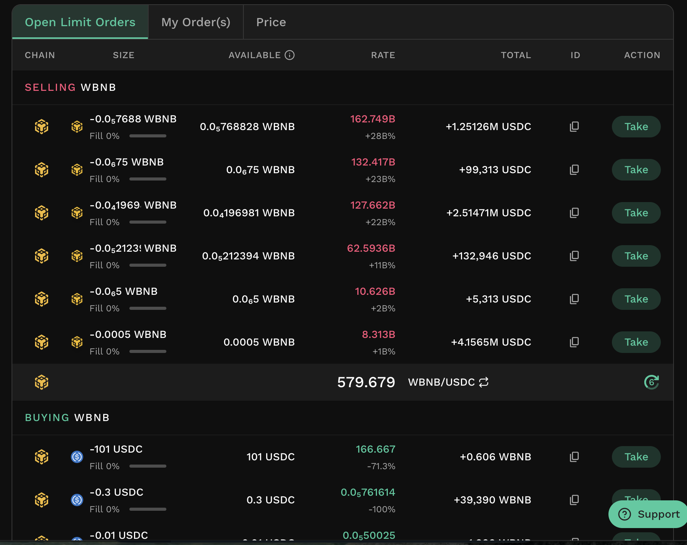
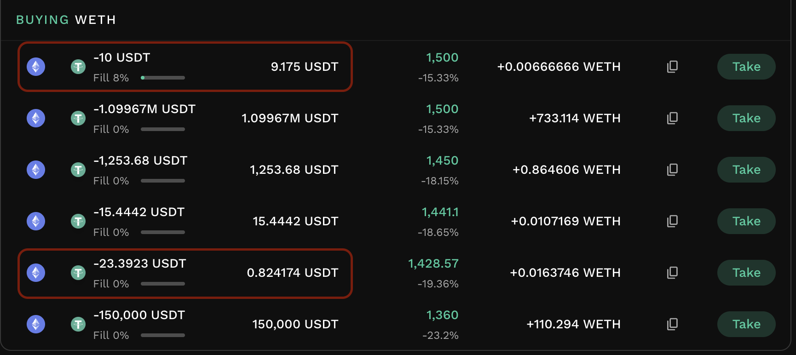
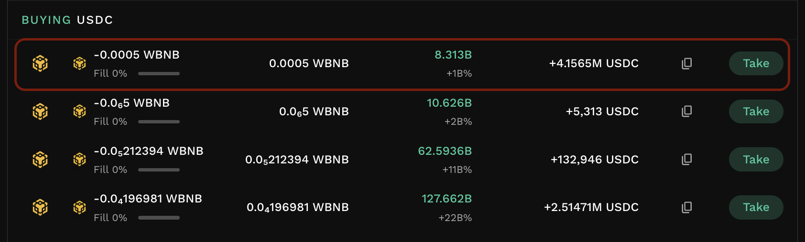
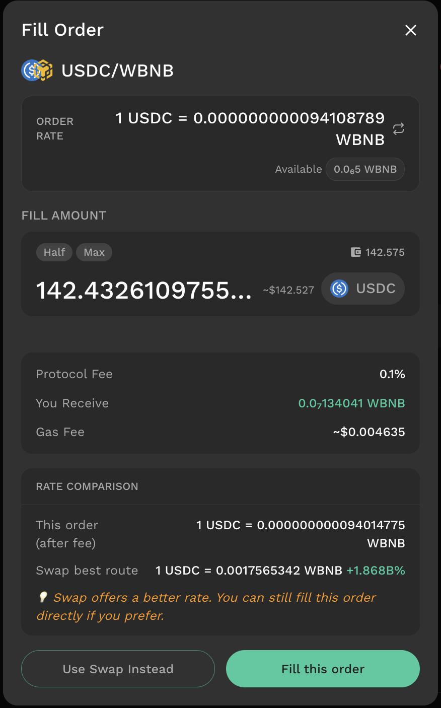
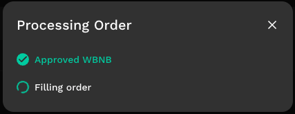

# Fill Limit Orders

## Introduction

Filling a limit order - also called **taking** it - means executing the trade against an open order that another user (the maker) has placed. The person who fills the order is the **taker**. Most KyberSwap limit orders are filled automatically through the Aggregator, and with the new version of Limit Order, you can also fill an open order directly from the order book.

KyberSwap Limit Orders are integrated as a liquidity source on the [**KyberSwap Aggregator**](../swap/), so an open order is filled automatically whenever its rate is competitive at that moment — a maker does not need a specific counterparty. Filling an order directly is an alternative you can use across all supported chains. Unlike creating an order (which is gasless), filling one is an on-chain transaction, so **the taker pays the gas fee and taker fee** to settle the trade.

**Swap usually gives a better rate**

Because limit orders are already a liquidity source on the KyberSwap Aggregator, a normal [Swap](https://app.notion.com/user-guide/swap.md) gives you a rate equal to or better than filling an order directly in almost all cases — if an order offered the best rate, the Aggregator would already be routing through it. Filling directly is offered for convenience, and the fill panel always shows both rates so you can compare.

### Reading the order book

The **Open Limit Orders** tab lists active orders for the selected pair so you can see what is available to fill. Orders are split into a **Selling** group (shown in red) and a **Buying** group (shown in green).

Each order row shows the chain it is on, its **size** in the maker's token (with the filled percentage), the **available** amount that can currently be filled, the order's **rate** (and how far it sits above or below the current market), the **total** on the other side of the pair, and a **Take** action.

<figure><figcaption></figcaption></figure>

#### The Available amount

The available amount of an order can be lower than the order's stated size for two reasons: the order has already been partially filled, or the maker's available balance or approval has dropped. A maker's committed tokens stay in their own wallet until the order is filled, so if the maker spends, moves, or reduces approval for those tokens after placing the order, the amount that can actually be filled decreases. This is why an order may show a smaller available amount than its size, or may not be fillable at all.

<figure><figcaption></figcaption></figure>

### Filling an order

To fill an order, open it from the order book, set the amount, review the fee and rate, and confirm the on-chain transaction.

**Step 1 - Select an order to take.** In the **Open Limit Orders** tab, choose **Take** on the order you want to fill. A panel opens showing the pair and the order details, including the order rate and the amount available to fill.

<figure><figcaption></figcaption></figure>

**Step 2 - Set your fill amount.** Enter how much of the available amount you want to fill. You can fill any amount up to the available maximum.

<figure><figcaption></figcaption></figure>

**Step 3 - Review fee, output, and rate comparison.** The panel shows the **protocol fee** applied to the fill, the amount **you receive** after the fee, and the estimated **gas fee**. A **rate comparison** shows the effective rate of filling this order directly (after fee) alongside the best rate available through a normal Swap. If Swap offers a better rate, you can choose to use Swap instead or fill the order directly.

<figure><figcaption></figcaption></figure>

**Step 4 - Fill the order.** Choose **Use Swap Instead** to switch to Swap with the same pair and amount (recommended when Swap offers a better rate), or **Fill this order** to proceed with the direct fill.

### Fill processing

After you confirm a direct fill, the app completes the trade on-chain, which may take one or more steps depending on your token and approvals. Each on-chain step requires a wallet signature and a gas fee. If you are filling with a native token (such as BNB or ETH), it is first wrapped into its ERC20 form. If you have not yet approved the Limit Order contract to spend the token, an approval step runs first - this also requires a gas fee - and is skipped on later fills. The final step is signing the order in your wallet; once signed, the order is filled. If a step fails, you can retry from that step, and any steps already completed do not need to be repeated. Once the fill succeeds, the order book refreshes.

<figure><figcaption></figcaption></figure>

**Orders can be filled by anyone**

Open orders can be filled by anyone, including [the KyberSwap Aggregator](../swap/). If another taker fills or the maker changes an order while you are acting on it, your transaction may not go through, and you will need to refresh the order book and try again.
