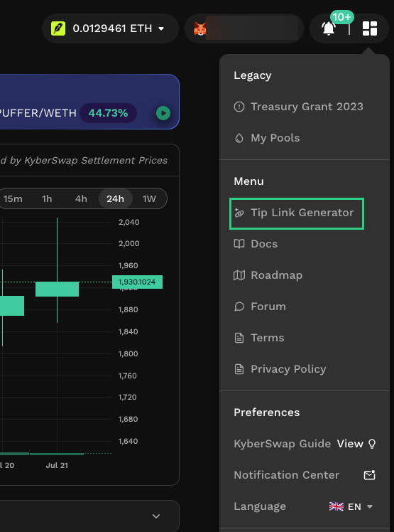
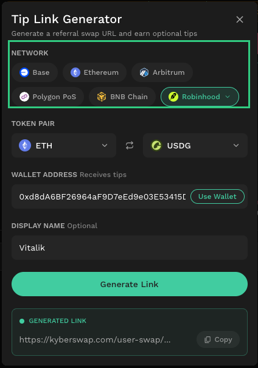
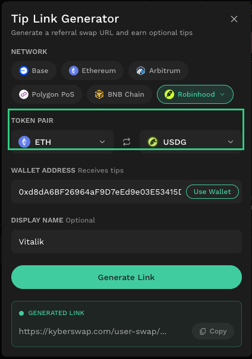
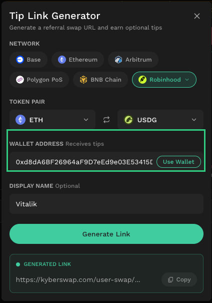
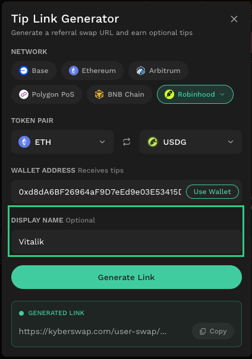
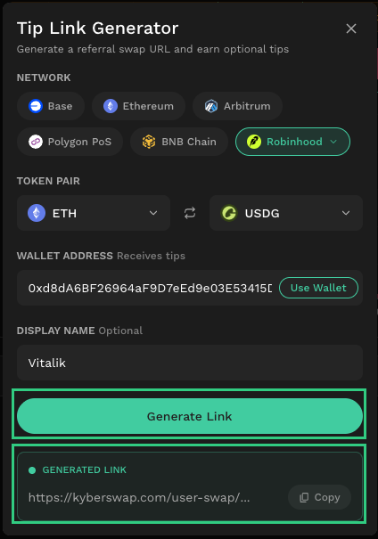

# Tip Link Generator

## **Introduction**

The Tip Link Generator is a self-serve tool that allows any user to create a shareable swap link with an optional tip enabled. When other users trade through the link and choose to tip, the tip is deducted from the output token and sent in full to the wallet address configured by the link creator. KyberSwap does not retain any portion of the tip.

The tool requires no sign-up or account. Any user can generate a link and share it immediately.

**Key details:**

* **Tips are paid in the output token.** The tip is calculated as a percentage of the swap and deducted from the output token. For example, if a user swaps ETH → USDC and chooses a 0.3% tip, the tip is taken from the USDC they receive. The estimated output displayed on the swap interface already reflects any tip deduction.
* **Tips are optional and default to no tip.** When a user opens a tip-enabled swap link, no tip is applied unless they actively select one. Preset options include 0.1%, 0.3%, and 0.5%, with the ability to enter a custom percentage up to a maximum of 20%.
* **100% of the tip goes to the link creator.** KyberSwap does not take any portion of the tip and does not charge a platform fee on swaps made through these links.
* **Tip details are shown before confirmation.** The tip amount and percentage are displayed transparently on the swap interface and in the swap confirmation modal, so users can review the full cost breakdown before proceeding.

Users are advised to review the URL and all details on the swap interface before confirming.


Any user can create a Tip Link Generator link or include fee parameters in a [kyberswap.com](http://kyberswap.com/) URL. When such fees are applied, they are always displayed transparently on the swap interface. KyberSwap itself does not charge any platform fee for swapping. No platform fee is applied when accessing [KyberSwap.com](https://kyberswap.com/) directly or calling directly from KyberSwap Aggregator API.

Users are advised to review the fee details on the swap interface when accessing KyberSwap from external sources.


## **How to use**

### **Step 1: Open the Tip Link Generator**

From the KyberSwap interface, open the **Menu** on the top right and select **Tip Link Generator**. You can also access it directly at [kyberswap.com/user-swap/create-tips](https://kyberswap.com/user-swap/create-tips).

<figure><figcaption></figcaption></figure>

### **Step 2: Select a network**

Choose the blockchain network for your swap link. Supported networks include Base, Ethereum, Arbitrum, Polygon PoS, BNB Chain, and others available under the "More" dropdown.

<figure><figcaption></figcaption></figure>

### **Step 3: Select a token pair**

Select the input and output tokens for the swap link under **Token Pair**. The generated link will open with this pair pre-filled, so users who click the link can swap immediately without searching for the token themselves.

<figure><figcaption></figcaption></figure>

### **Step 4: Enter your wallet address**

Under **Wallet Address**, paste the wallet address that will receive tips, or click **Connect** to auto-fill from your connected wallet. This is the address where 100% of any tips will be sent.

<figure><figcaption></figcaption></figure>

### **Step 5: Set a display name (optional)**

Under **Display Name**, enter a name (e.g. "DefiAlpha") that will be shown to users who open your link. This field is optional.

<figure><figcaption></figcaption></figure>

**Step 6: Generate and share your link**

Click **Generate Link**. The personalized swap link will appear under **Generated Link**. Click **Copy** to copy the link and share it with your audience.

For example:

`https://kyberswap.com/user-swap?chainId=4663&inputCurrency=ETH&outputCurrency=0x5fc5360D0400a0Fd4f2af552ADD042D716F1d168&enableTip=true&feeReceiver=0xd8dA6BF26964aF9D7eEd9e03E53415D37aA96045&feeAmount=10&chargeFeeBy=currency_out&clientId=kyberswap&creatorName=Vitalik`

<figure><figcaption></figcaption></figure>
